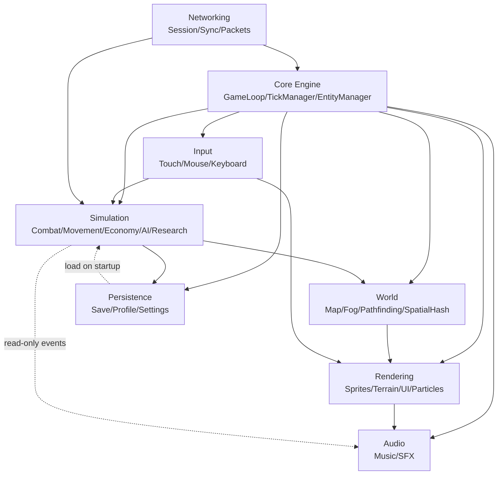
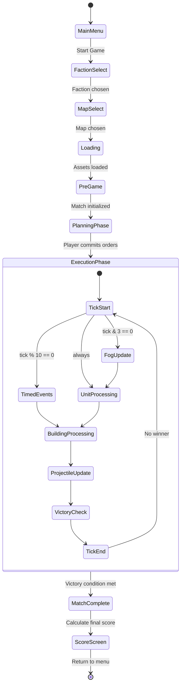
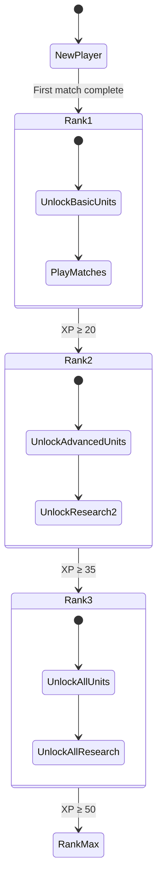
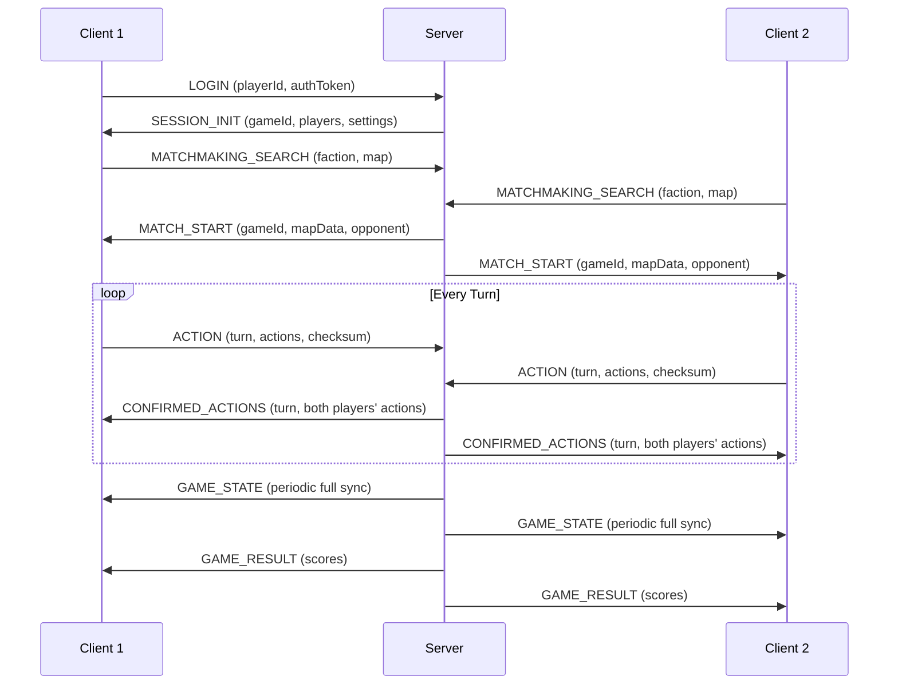
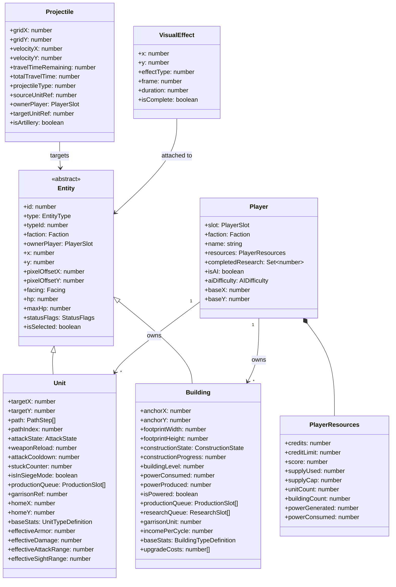
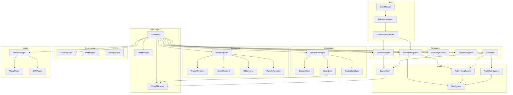

# Art of War 3 — Recreation Blueprint

> **Version**: 1.0  
> **Date**: 2026-03-05  
> **Source**: Reverse-engineered from Art of War 2 Online (`com.herocraft.game.artofwar2ol`)  
> **Purpose**: Complete, developer-ready specification for a modern recreation (Art of War 3)  
> **Confidence**: Based on confirmed + probable findings from decompiled source

---

## Table of Contents

1. [System Architecture](#1-system-architecture)
2. [Object Model](#2-object-model)
3. [Gameplay Loop](#3-gameplay-loop)
4. [RTS Framework](#4-rts-framework)
5. [Data Structures](#5-data-structures)
6. [UML-Style Diagrams](#6-uml-style-diagrams)
7. [Modern Implementation Recommendations](#7-modern-implementation-recommendations)
8. [Appendix A: Complete Unit Stats](#appendix-a-complete-unit-stats)
9. [Appendix B: Complete Building Stats](#appendix-b-complete-building-stats)
10. [Appendix C: Complete Research Tree](#appendix-c-complete-research-tree)
11. [Appendix D: Combat Formulas Reference](#appendix-d-combat-formulas-reference)

---

## 1. System Architecture

### 1.1 Major Subsystems

The game is decomposed into eight major subsystems. Each subsystem owns a bounded domain of the codebase and communicates with others through well-defined interfaces.

| # | Subsystem | Responsibility | Key Modules |
|---|-----------|---------------|-------------|
| 1 | **Core Engine** | Game loop, tick timing, fixed timestep, entity lifecycle | `GameLoop`, `TickManager`, `EntityManager` |
| 2 | **Simulation** | All deterministic game-state mutation: combat, movement, economy, AI | `CombatSystem`, `MovementSystem`, `EconomySystem`, `AISystem`, `ResearchSystem` |
| 3 | **World** | Map, terrain, fog of war, pathfinding, spatial queries | `MapSystem`, `FogOfWarSystem`, `PathfindingSystem`, `SpatialHash` |
| 4 | **Rendering** | Drawing terrain, entities, projectiles, UI, minimap, effects | `RenderPipeline`, `SpriteRenderer`, `TerrainRenderer`, `UIRenderer`, `ParticleRenderer` |
| 5 | **Input** | Touch, mouse, keyboard input mapping and command dispatch | `InputMapper`, `SelectionManager`, `CommandDispatcher` |
| 6 | **Networking** | Multiplayer session management, state sync, lockstep protocol | `NetworkManager`, `SessionClient`, `StateSync`, `PacketSerializer` |
| 7 | **Audio** | Music, SFX, ambient sound | `AudioManager`, `MusicPlayer`, `SFXPlayer` |
| 8 | **Persistence** | Save/load, settings, player profile, unlocks | `SaveManager`, `ProfileStore`, `SettingsStore` |

### 1.2 Dependency Diagram (Mermaid)



### 1.3 Subsystem Communication Patterns

| Source → Target | Communication | Description |
|----------------|---------------|-------------|
| Input → Simulation | Command objects | Player commands dispatched as immutable `ICommand` instances |
| Simulation → World | Query/Mutate calls | Pathfinding requests, terrain queries |
| Simulation → Rendering | Event bus | Damage numbers, explosions, sound triggers |
| World → Rendering | Data pull | Terrain tiles, entity positions for draw |
| Networking → Simulation | State patches | Server-authoritative state updates applied to sim |
| Simulation → Networking | Action stream | Player actions serialized and sent to server |
| Core → All | Tick signal | Fixed-timestep update signal drives all subsystems |

### 1.4 Original vs Modern Architecture Comparison

| Aspect | Original (J2ME Port) | Modern Recreation |
|--------|----------------------|-------------------|
| Language | Java (J2ME MIDlet → Android Canvas) | TypeScript (or C#) |
| Rendering | Android Canvas/SurfaceView, software blit | WebGL/WebGPU or GPU-accelerated pipeline |
| Entity storage | Flat `byte[] ca[7272]` with stride 101 | ECS (Entity-Component-System) or typed objects |
| Threading | Single game thread + network threads | Main loop + worker threads for pathfinding |
| Screen variants | 3 code packages (s0/s1/s2) | Single responsive codebase with DPI scaling |
| Network | TCP with custom XOR cipher | WebSocket or UDP with TLS + signed payloads |
| Data files | Encrypted binary blobs | JSON/YAML data files with hot-reload |

---

## 2. Object Model

### 2.1 Entity Hierarchy

The original game used a flat byte array (`ca[]`) with stride-101 indexing. The recreation uses typed classes with clear semantics. All entities share a common base.

```typescript
// ─── Base Entity ────────────────────────────────────────────────
abstract class Entity {
  id: number;               // Unique entity ID
  type: EntityType;         // Unit, Building, Mine, Projectile, etc.
  typeId: number;           // Type index within faction table (0-24)
  faction: Faction;         // CONFEDERATION | REBELS | NEUTRAL
  ownerPlayer: PlayerSlot;  // 0 or 1 (or -1 for neutral)
  x: number;                // Grid X (0-127)
  y: number;                // Grid Y (0-127)
  pixelOffsetX: number;     // Sub-tile pixel offset X
  pixelOffsetY: number;     // Sub-tile pixel offset Y
  facing: Facing;           // 0-7 (8 cardinal + ordinal directions)
  hp: number;               // Current HP (-1 = dying/dead)
  maxHp: number;            // Max HP (from type definition)
  statusFlags: StatusFlags; // Bitfield of active states
  isSelected: boolean;      // UI selection state
}

enum Faction { CONFEDERATION, REBELS, NEUTRAL }
enum PlayerSlot { PLAYER_0 = 0, PLAYER_1 = 1, NEUTRAL = -1 }
enum Facing { N, NE, E, SE, S, SW, W, NW }
enum EntityType { UNIT, BUILDING, MINE, PROJECTILE }
```

```typescript
// ─── Status Flags (bitfield) ────────────────────────────────────
class StatusFlags {
  productionSlot0Active: boolean;  // bit 0
  productionSlot1Active: boolean;  // bit 1
  productionSlot2Active: boolean;  // bit 2
  beingAttacked: boolean;          // bit 3
  selected: boolean;               // bit 4
  retreating: boolean;             // bit 5
  garrisoned: boolean;             // bit 6
  specialReady: boolean;           // bit 7
}
```

### 2.2 Unit Model

```typescript
class Unit extends Entity {
  type: EntityType.UNIT;

  // ── Position & Movement ─────────────────
  targetX: number;              // Movement target X
  targetY: number;              // Movement target Y
  displayFacing: Facing;        // Visual facing (for smooth rotation)
  secondaryFacing: Facing;      // Turret/body facing (for vehicles)
  targetFacing: Facing;         // Direction to face for attack
  path: PathStep[];             // Current path (max 50 steps)
  pathIndex: number;            // Current step in path (waypoint index)
  pathEnd: number;              // End of valid path
  moveAnimFrame: number;        // Movement animation counter
  stuckCounter: number;         // Ticks stuck (triggers recalc at ±5)

  // ── Combat ──────────────────────────────
  attackAnimFrame: number;      // Attack animation counter
  attackState: AttackState;     // Idle, Attacking, Cooldown
  weaponReload: number;         // Reload cooldown timer
  attackCooldown: number;       // Ticks until next attack allowed
  actionState: ActionState;     // 0=idle, 1=attacking, 2=moving, 3=casting

  // ── Garrison & Transport ────────────────
  garrisonRef: number;          // Building/unit this unit is garrisoned in
  cargo: number;                // Transport cargo unit ref

  // ── Rally & Home ────────────────────────
  homeX: number;                // Rally point X
  homeY: number;                // Rally point Y
  rallyRef: number;             // Rally point reference

  // ── Production (for production buildings that are also units) ──
  productionQueue: (ProductionSlot | null)[];  // 3 slots
  productionProgress: number[]; // 3 timers

  // ── Upgrades & Effects ──────────────────
  upgradeLevel: number;         // Production upgrade level
  upgradeSlots: number[];       // 3 upgrade slots
  shieldBonus: number;          // Shield/armor bonus from research
  stealthTimer: number;         // Stealth/visibility timer

  // ── Siege Mode ──────────────────────────
  isInSiegeMode: boolean;       // Deployed/undeployed state
  canSiege: boolean;            // Whether unit type supports siege

  // ── Type-derived stats (from UnitTypeDefinition) ──
  readonly baseStats: UnitTypeDefinition;

  // ── Computed stats (include research bonuses) ──
  get effectiveArmor(): number;
  get effectiveDamage(): number;
  get effectiveAttackRange(): number;
  get effectiveSightRange(): number;
  get effectiveAttackSpeed(): number;
  get effectiveSpeed(): number;
}

enum AttackState { IDLE, TARGETING, FIRING, COOLDOWN }
enum ActionState { IDLE = 0, ATTACKING = 1, MOVING = 2, CASTING = 3, DYING = 10 }
```

```typescript
// ─── Unit Type Definition (static data) ─────────────────────────
interface UnitTypeDefinition {
  typeId: number;              // Index in faction unit table
  name: string;                // e.g. "T-21 Hammer"
  category: UnitCategory;      // Infantry, Vehicle, Mine
  description: string;

  // ── Base Stats ─────────────────────────
  hp: number;                  // Max HP
  damage: number;              // Base damage per hit
  armor: number;               // Base armor (0-10 scale)
  extendedArmor: number;       // Armor with upgrades
  speed: number;               // Movement speed class
  sightRange: number;          // Vision radius (grid cells)
  attackRange: number;         // Attack range (grid cells)
  attackBonus: number;         // Bonus damage modifier
  attackSpeed: number;         // Ticks between attacks (lower = faster)
  siegeTargets: number;        // Bitmask of targetable categories (255 = all)

  // ── Cost & Production ──────────────────
  baseCost: number;            // Supply cost
  creditCost: number;          // Credit cost
  rewardCredits: number;       // Credits awarded to killer
  buildTime: number;           // Ticks to produce
  rank: number;                // Tech tier required
  upgradeLevel: number;        // Prerequisite research level
  availabilityFlag: number;    // -1 = always, else research ID required

  // ── Type Classification ────────────────
  typeClass: number;           // Sub-category for targeting priority
  isInfantry: boolean;         // Derived from bitmask 16447
  isMachinery: boolean;        // Derived from bitmask 16256
  canSiege: boolean;           // Derived from bitmask 114688
  isMine: boolean;             // Whether this is a mine entity
}

enum UnitCategory { INFANTRY, VEHICLE, MINE }
```

### 2.3 Building Model

```typescript
class Building extends Entity {
  type: EntityType.BUILDING;

  // ── Position & Footprint ────────────────
  anchorX: number;             // Anchor point X (top-left of footprint)
  anchorY: number;             // Anchor point Y
  topLeftX: number;            // Top-left corner X
  topLeftY: number;            // Top-left corner Y
  footprintWidth: number;      // In tiles (from building definition)
  footprintHeight: number;     // In tiles

  // ── Construction ────────────────────────
  constructionState: ConstructionState;  // None, Building, Complete, Destroyed
  constructionProgress: number;          // 0 to maxHp
  buildingType: number;                  // Building type ID
  buildingLevel: number;                 // Current upgrade level (0-2)

  // ── Power ───────────────────────────────
  powerConsumed: number;       // Power this building requires
  powerProduced: number;       // Power this building generates
  powerRadius: number;         // Radius of power coverage
  isPowered: boolean;          // Whether building currently has power

  // ── Production ──────────────────────────
  productionQueue: (ProductionSlot | null)[];  // 3 production slots
  productionProgress: number[];
  productionSpeed: number;     // Base production speed modifier

  // ── Research ────────────────────────────
  researchQueue: (ResearchSlot | null)[];       // Up to 4 research slots
  researchProgress: number[];

  // ── Garrison ────────────────────────────
  garrisonUnit: number;        // Unit reference garrisoned inside
  garrisonCooldown: number;    // Cooldown between garrison enter/exit

  // ── Resource Generation ─────────────────
  resourceTimer: number;       // Ticks since last income tick
  resourceCapacity: number;    // Max resource storage
  resourceType: number;        // Type of resource generated
  incomePerCycle: number;      // Credits generated per income tick

  // ── Links ───────────────────────────────
  linkRef: number;             // Reference to linked entity
  buildingFlags: number;       // Building state flags
  buildingState: number;       // Current building operational state

  // ── Tech Requirements ───────────────────
  techRequirement: number;     // Required research level to build

  // ── Type-derived stats ──────────────────
  readonly baseStats: BuildingTypeDefinition;

  // ── Upgrade costs ───────────────────────
  upgradeCosts: number[];      // 3 levels [0]=level1, [1]=level2, [2]=level3
}

enum ConstructionState { NONE = 0, BUILDING = 1, COMPLETE = 2, DESTROYED = -1 }
```

```typescript
// ─── Building Type Definition (static data) ─────────────────────
interface BuildingTypeDefinition {
  typeId: number;
  name: string;
  faction: Faction;
  category: BuildingCategory;

  // ── Stats ───────────────────────────────
  hp: number;
  armor: number;
  extendedArmor: number;
  speed: number;               // Used as build-time modifier
  attackBonus: number;         // Turret damage bonus (for defensive buildings)
  sightRange: number;
  attackRange: number;         // Turret range (for defensive buildings)

  // ── Construction ────────────────────────
  baseCost: number;            // Supply cost
  creditCost: number;          // Credit cost
  rewardCredits: number;       // Credits for destroying
  buildTime: number;           // Ticks to construct

  // ── Power ───────────────────────────────
  powerConsumed: number;
  powerProduced: number;

  // ── Production ──────────────────────────
  queueSlots: number;          // 0, 4, or 6 production/research slots
  techRequirement: number;     // Research level required

  // ── Footprint ───────────────────────────
  footprintWidths: number[];   // Per-level widths
  footprintHeights: number[];  // Per-level heights

  // ── Upgrades ────────────────────────────
  upgradeCosts: number[];      // [level1Cost, level2Cost, level3Cost]
}

enum BuildingCategory {
  HEADQUARTERS,    // Command Centre / Headquarters
  POWER,           // Generator / Powerplant
  INFANTRY_PROD,   // Infantry Centre / Barracks
  VEHICLE_PROD,    // Machine Factory / Factory
  TECH,            // Technology Centre / Laboratory
  DEFENSE,         // Bunker / Tower
  SENSOR,          // Locator
  OFFENSE,         // Rocket Launcher / Wall
}
```

### 2.4 Projectile Model

```typescript
class Projectile {
  id: number;
  gridX: number;              // Grid X position
  gridY: number;              // Grid Y position
  pixelOffsetX: number;       // Sub-tile pixel offset X
  pixelOffsetY: number;       // Sub-tile pixel offset Y
  velocityX: number;          // Pixels per tick X
  velocityY: number;          // Pixels per tick Y
  travelTimeRemaining: number;// Ticks until impact
  totalTravelTime: number;    // Total calculated flight time
  elapsedTravelTime: number;  // Ticks since launch
  projectileType: number;     // Projectile type (0-10+)
  sourceUnitRef: number;      // Firing unit reference
  ownerPlayer: PlayerSlot;    // Firing player
  targetUnitRef: number;      // Target unit reference
  impactFlags: number;        // Impact behavior flags
  isActive: boolean;          // Whether projectile is in flight

  // ── Artillery Specific ──────────────────
  isArtillery: boolean;       // Type 10 = artillery (splash damage)
  splashRadius: number;       // Splash damage radius (artillery only)

  static readonly MAX_PROJECTILES = 400;
}
```

### 2.5 Resource Model

```typescript
class PlayerResources {
  playerSlot: PlayerSlot;
  credits: number;             // Primary currency (auto-generated)
  creditLimit: number;         // Max credits (100 base, 120 with research)
  score: number;               // Cumulative match score
  scoreDisplay: number;        // Display score (different from actual)
  supplyUsed: number;          // Current supply consumption
  supplyCap: number;           // Max supply (8 base, expandable)
  unitCount: number;           // Current living units
  buildingCount: number;       // Current living buildings
  powerGenerated: number;      // Total power produced
  powerConsumed: number;       // Total power consumed
}

class ResourceDeposit {
  x: number;
  y: number;
  type: number;                // Resource type ID
  amount: number;              // Remaining amount (if finite)
}
```

### 2.6 Player Model

```typescript
class Player {
  slot: PlayerSlot;
  faction: Faction;
  name: string;

  // ── Resources ───────────────────────────
  resources: PlayerResources;

  // ── Research ────────────────────────────
  completedResearch: Set<number>;  // Research IDs 0-47
  activeResearch: (ResearchSlot | null)[];
  researchModifier: number;        // Speed modifier from difficulty

  // ── Base ────────────────────────────────
  baseX: number;               // Starting X position
  baseY: number;               // Starting Y position
  baseBuildingArmour: number;  // Building armour rating (from research)

  // ── AI ──────────────────────────────────
  isAI: boolean;
  aiDifficulty: AIDifficulty;  // Easy, Normal, Hard
  aiAggressiveness: number;    // 0-2 scale

  // ── Economy Modifiers ───────────────────
  productionModifier: number;  // Speed multiplier
  creditModifier: number;      // Income multiplier
  unitLimitBonus: number;      // Extra unit slots from research

  // ── Online/Meta ─────────────────────────
  playerId: number;            // Unique player ID (server-assigned)
  rank: number;                // Current rank tier
  xp: number;                  // Current XP in rank
}

enum AIDifficulty { EASY = 0, NORMAL = 1, HARD = 2 }
```

### 2.7 Team Model

```typescript
class Team {
  id: number;
  players: Player[];          // 1-2 players per team
  score: number;              // Team aggregate score
  allianceType: AllianceType;
}

enum AllianceType { SOLO, ALLY, CLAN }
```

### 2.8 Ability Model

```typescript
class Ability {
  id: number;
  name: string;
  description: string;
  type: AbilityType;
  cooldown: number;           // Ticks between uses
  currentCooldown: number;    // Remaining cooldown
  range: number;              // Activation range (grid cells)
  duration: number;           // Effect duration (0 = instant)
  isReady: boolean;

  // ── Effects ─────────────────────────────
  effects: AbilityEffect[];
}

enum AbilityType {
  SIEGE_MODE,       // Deploy/undeploy for increased range + damage
  GARRISON,         // Enter/exit building
  LAY_MINE,         // Place a mine at current position
  SELF_DESTRUCT,    // Mine detonation
  REPAIR,           // Machinery self-repair
}

class AbilityEffect {
  type: EffectType;
  value: number;
  duration: number;
  targetType: TargetType;
}

enum EffectType {
  DAMAGE, HEAL, ARMOR_BUFF, SPEED_BUFF, RANGE_BUFF,
  SIGHT_BUFF, STEALTH, REVEAL, STUN
}
enum TargetType { SELF, ALLY, ENEMY, AREA, POINT }
```

### 2.9 Effect Model

```typescript
class VisualEffect {
  id: number;
  x: number;
  y: number;
  pixelOffsetX: number;
  pixelOffsetY: number;
  effectType: number;         // Effect sprite index
  frame: number;              // Current animation frame
  frameCount: number;         // Total animation frames
  duration: number;           // Total tick duration
  elapsed: number;            // Ticks elapsed
  isComplete: boolean;

  // ── Effect Categories ──────────────────
  // Type 6: Debris
  // Types 11-14: Fire effects
  // Types 27-31: Smoke effects
  // Types 32+: Explosion/impact effects
}
```

### 2.10 Production Slot Model

```typescript
interface ProductionSlot {
  unitTypeId: number;         // What's being produced
  progress: number;           // Current construction HP
  maxProgress: number;        // Target HP to complete
  startTime: number;          // Tick when production started
}

interface ResearchSlot {
  researchId: number;         // Research ID (0-47)
  progress: number;           // Current progress
  maxProgress: number;        // Total ticks needed
  startTime: number;          // Tick when research started
}
```

---

## 3. Gameplay Loop

### 3.1 Match Lifecycle



#### Detailed Tick Sequence

```
Tick N:
  1. If N % 30 == 0: Reset battle flag
  2. If N % 10 == 0: Process timed events (reinforcements, AI events)
  3. If N & 3 == 0:  Update fog of war for both players
  4. For each player (0, 1):
     a. For each unit slot (player*50+1 to (player+1)*50):
        - Skip if unit doesn't exist (HP == 0)
        - Process unit state machine (idle → attack/move)
        - Update movement (advance along path)
        - Update attack (reload, fire projectile)
        - Check for stuck (stuckCounter ≥ 5 → recalculate)
     b. If player's command center destroyed this tick: rebuild base data
  5. Process buildings:
     a. Update construction progress
     b. Update production progress
     c. Generate income (every 127 ticks for active buildings)
     d. Update research progress
  6. Update all projectiles (max 400):
     a. Move projectile by velocity
     b. Check for impact (elapsed ≥ totalTravelTime)
     c. Apply damage on impact (with splash for artillery)
  7. Update visual effects
  8. Check victory conditions
  9. Advance game tick (N++)
```

### 3.2 Match Creation Flow

```
1. Player selects game mode (Campaign / Skirmish / Online)
2. For Online: Connect to server, authenticate, enter lobby
3. Map selection (or auto-selected for matchmaking)
4. Faction selection (Confederation or Rebels)
5. Server creates match session (sends SESSION_INIT + MATCH_START)
6. Map data transmitted (terrain, starting positions, victory conditions)
7. Both players load assets
8. Game initializes:
   - Place starting buildings (Command Centre at base position)
   - Set starting resources (credits: 100, supply: 20)
   - Initialize fog of war (all unexplored)
   - Start tick counter
9. Planning phase begins (first tick = 0)
10. Execution phase: game loop runs at fixed timestep
```

### 3.3 Match Completion Conditions

| Condition | Rule | Result |
|-----------|------|--------|
| **Destruction** | Opponent has 0 buildings AND ≤7 units | Opponent loses |
| **Time Limit** | Game tick ≥ `timeLimit * 60 * 8` | Higher combined score wins |
| **Concede** | Player manually surrenders | Opponent wins |

**Scoring on destruction**:
- Destroy enemy building: +200 credits, +100 score
- Kill enemy unit: `(unitCost * 3 * distToEnemyBase) / (baseDistance * 2)` credits
- Lose own building: -100 score
- Capture building: +200 credits, +100 score, +600 display score

### 3.4 Progression Lifecycle (Meta-Game)



#### Rank System

| Rank | XP Threshold | Credit Reward | Bonus Points | Unlocks |
|------|-------------|---------------|-------------|---------|
| 1 | 20 | 10 | 0 | Basic infantry & buildings |
| 2 | 35 | 25 | 3 | Advanced vehicles, Tier 2 research |
| 3 | 50 | 51 | 6 | All units, Tier 3 research |

#### Unlock Progression

1. **Starting state**: Infantry, Grenadier, Command Centre, Generator, Infantry Centre
2. **Rank 1**: Flame Assault, AV-40 Fortress, Bunker
3. **Rank 2**: T-21 Hammer, T-22 Zeus, Machine Factory, Technology Centre, Rocket Launcher
4. **Rank 3**: MLRS Torrent, Locator, all mines, all research

---

## 4. RTS Framework

### 4.1 Input Systems

#### Original Input Handling

The original game supported:
- **Touch**: `ACTION_DOWN`, `ACTION_MOVE`, `ACTION_UP` on SurfaceView
- **Keyboard**: D-pad navigation, soft keys (LSK/RSK)
- **No mouse**: Mobile-only

#### Modern Input Architecture

```typescript
class InputSystem {
  private selectionManager: SelectionManager;
  private commandDispatcher: CommandDispatcher;
  private cameraController: CameraController;

  // ── Input Bindings ──────────────────────
  // Touch (mobile)
  onTap(position: ScreenPos): void;
  onDoubleTap(position: ScreenPos): void;
  onLongPress(position: ScreenPos): void;
  onDrag(start: ScreenPos, end: ScreenPos): void;
  onPinch(scale: number): void;

  // Mouse (desktop)
  onClick(position: ScreenPos, button: MouseButton): void;
  onRightClick(position: ScreenPos): void;
  onDragSelect(rect: ScreenRect): void;
  onScroll(delta: number): void;

  // Keyboard
  onKeyDown(key: Key): void;
  onKeyUp(key: Key): void;
}

// ── Input → Action Mapping ────────────────
const INPUT_BINDINGS = {
  // Selection
  LEFT_CLICK: 'SELECT',
  LEFT_DRAG: 'BOX_SELECT',
  RIGHT_CLICK: 'MOVE_ATTACK',
  DOUBLE_CLICK: 'SELECT_ALL_OF_TYPE',

  // Camera
  WASD: 'CAMERA_PAN',
  ARROW_KEYS: 'CAMERA_PAN',
  MOUSE_EDGE: 'CAMERA_PAN',
  SCROLL: 'ZOOM',
  MIDDLE_DRAG: 'CAMERA_DRAG',

  // Commands
  A: 'ATTACK_MOVE',
  S: 'STOP',
  H: 'HOLD_POSITION',
  D: 'SIEGE_MODE',
  G: 'GARRISON',
  P: 'PATROL',
  CTRL+1-9: 'CREATE_CONTROL_GROUP',
  1-9: 'SELECT_CONTROL_GROUP',

  // Build
  B: 'OPEN_BUILD_MENU',
  Q: 'BUILD_FIRST',
  W: 'BUILD_SECOND',
  E: 'BUILD_THIRD',

  // Game
  SPACE: 'CENTER_ON_SELECTION',
  TAB: 'CYCLE_UNITS',
  ESC: 'CANCEL',
  F1-F4: 'SELECT_PRODUCTION_TAB',
};
```

#### Touch Input Flow

```
1. Touch Down at screen position (sx, sy)
2. Convert to world position:
   - worldX = (sx + cameraX) / TILE_WIDTH
   - worldY = (sy + cameraY) / TILE_HEIGHT
3. If tap on own unit/building → SELECT
4. If tap on enemy unit (visible, in fog clear) → ATTACK_TARGET
5. If tap on terrain → MOVE_TO
6. Long press → CONTEXT_MENU (build, research, siege mode)
7. Drag from unit → MOVE_TO with facing preview
```

### 4.2 Rendering Systems

#### Original Rendering Pipeline

```
Game Canvas (k.java) → v (Abstract Graphics) → aq (Android Canvas)
    → SurfaceView.lockCanvas()
    → Canvas.drawBitmap() / drawLine() / drawRect() / drawText()
    → SurfaceView.unlockCanvasAndPost()
```

- Software-only rendering on Android Canvas
- RGB565 color depth (16-bit)
- Sprite system: packed images with alpha masks (even/odd pairs)
- No GPU acceleration

#### Modern Rendering Approach

```typescript
class RenderPipeline {
  // ── Render Order (back to front) ────────
  // 1. Terrain tiles (with fog overlay)
  // 2. Building footprints & construction
  // 3. Ground-level effects (shadows, mine markers)
  // 4. Units (sorted by Y for depth)
  // 5. Projectiles
  // 6. Air-level effects (explosions, smoke)
  // 7. UI overlay (selection boxes, health bars)
  // 8. Minimap
  // 9. HUD (resources, production queue, research)

  render(frame: FrameContext): void {
    this.renderTerrain(frame);
    this.renderFogOfWar(frame);
    this.renderBuildings(frame);
    this.renderGroundEffects(frame);
    this.renderUnits(frame);        // Y-sorted
    this.renderProjectiles(frame);
    this.renderAirEffects(frame);
    this.renderUIOverlay(frame);
    this.renderMinimap(frame);
    this.renderHUD(frame);
  }
}
```

#### Suggested Rendering Technology

| Layer | Technology | Reason |
|-------|-----------|--------|
| Web (primary) | WebGL2 with sprite batching | Cross-platform, 60fps for 2D RTS |
| Desktop alternative | SDL2 + OpenGL | Native performance, Steam distribution |
| Mobile alternative | React Native + Canvas | Touch-optimized UI |
| Sprite format | Texture atlas (Aseprite export) | Efficient batching, animation support |
| Tile rendering | Chunked tilemap (16×16 chunks) | Only re-render visible chunks |
| Effects | Particle system (GPU instanced) | Hundreds of simultaneous effects |

#### Terrain Rendering

```typescript
class TerrainRenderer {
  // Original: 128×128 grid, each tile 30×20 pixels (isometric-ish)
  // Modern: Scale-invariant, rendered as 2D top-down with iso perspective

  // Tile color palette (RGB565 → RGB888 conversion from original)
  private static PALETTES: Record<TerrainType, number[]> = {
    DEEP_WATER:    [142, 134, 231],
    SHALLOW_WATER: [142, 134, 231],
    SAND:          [166, 158, 231],
    PLAINS:        [206, 198, 231],
    FOREST:        [190, 182, 231],
    ROAD:          [75, 67, 75],
    MOUNTAIN:      [107, 99, 107],
    BRIDGE:        [126, 118, 126],
    SNOW:          [230, 230, 230],
    FOG_WAR:       [117, 117, 117],     // Previously explored
    FOG_UNEXPLORED:[66, 66, 66],        // Never seen
    SWAMP:         [40, 32, 40],
  };

  // Render only visible tiles within viewport
  renderVisibleTiles(camera: Camera, map: GameMap): void;
  renderFogOverlay(camera: Camera, fog: FogOfWar): void;
}
```

### 4.3 Simulation Systems

#### Tick-Based Fixed Timestep

```typescript
class Simulation {
  static readonly TICK_RATE = 10;          // 10 ticks per second (100ms per tick)
  static readonly MAX_UNITS_PER_PLAYER = 50;
  static readonly MAX_BUILDINGS_PER_PLAYER = 22;
  static readonly MAX_PROJECTILES = 400;
  static readonly MAX_PATH_LENGTH = 50;
  static readonly MAP_SIZE = 128;          // 128×128 tiles
  static readonly TILE_WIDTH = 30;         // pixels
  static readonly TILE_HEIGHT = 20;        // pixels

  private tick: number = 0;
  private accumulator: number = 0;
  private readonly FIXED_DT = 100;         // ms per tick

  update(realDt: number): void {
    this.accumulator += realDt;
    while (this.accumulator >= this.FIXED_DT) {
      this.processTick();
      this.accumulator -= this.FIXED_DT;
    }
    // Interpolation factor for rendering
    const alpha = this.accumulator / this.FIXED_DT;
    this.renderWithInterpolation(alpha);
  }

  private processTick(): void {
    this.tick++;

    // 1. Timed events (every 10 ticks)
    if (this.tick % 10 === 0) this.processTimedEvents();

    // 2. Fog of war (every 4 ticks)
    if ((this.tick & 3) === 0) this.updateFogOfWar();

    // 3. Process all units
    for (const player of this.players) {
      for (const unit of player.units) {
        this.processUnit(unit);
      }
    }

    // 4. Process buildings
    this.processBuildings();

    // 5. Update projectiles
    this.updateProjectiles();

    // 6. Check victory
    this.checkVictoryConditions();
  }
}
```

#### Combat System (Tick-Based)

```typescript
class CombatSystem {
  // ── Damage Formula (faithful to original) ───────────
  calculateDamage(baseDamage: number, targetArmor: number): number {
    const reducedDamage = (baseDamage * (10 - targetArmor)) / 10;
    const clampedDamage = Math.max(
      Math.min(reducedDamage, baseDamage - targetArmor),
      1  // Minimum 1 damage always
    );
    return clampedDamage;
  }

  // ── Effective Armor (with research bonuses) ─────────
  getEffectiveArmor(target: Unit | Building): number {
    if (target instanceof Building) {
      return this.getBuildingArmor(target);
    }
    const baseArmor = target.baseStats.armor;
    const researchBonus = this.getResearchArmorBonus(target);
    return baseArmor + researchBonus;
  }

  // ── Splash Damage (artillery type 10) ──────────────
  applySplashDamage(centerX: number, centerY: number,
                    radius: number, baseDamage: number,
                    attackerPlayer: PlayerSlot): void {
    for (let dx = -radius; dx <= radius; dx++) {
      for (let dy = -radius; dy <= radius; dy++) {
        const tx = centerX + dx;
        const ty = centerY + dy;
        if (!this.map.inBounds(tx, ty)) continue;

        const targets = this.spatialHash.getEntitiesAt(tx, ty);
        for (const target of targets) {
          const armor = this.getEffectiveArmor(target);
          const distanceFactor = this.getDistanceFactor(baseDamage, dx, dy);
          const damage = Math.max(
            Math.min(((10 - armor) * distanceFactor) / 10,
                     distanceFactor - armor),
            1
          );
          this.applyDamage(target, damage, attackerPlayer);
        }
      }
    }
  }

  // ── Kill Reward Calculation ─────────────────────────
  calculateKillReward(killedUnit: Unit, killerPlayer: PlayerSlot): number {
    const unitCost = killedUnit.baseStats.creditCost;
    const distToEnemy = this.getDistanceToEnemyBase(killedUnit);
    const baseDistance = this.getAverageBaseDistance();
    return (unitCost * 3 * distToEnemy) / (baseDistance * 2);
  }
}
```

#### Economy System (Tick-Based)

```typescript
class EconomySystem {
  // Income tick: every 127 game ticks when building is active and powered
  static readonly INCOME_INTERVAL = 127;

  processIncome(player: Player): void {
    for (const building of player.buildings) {
      if (!building.isPowered) continue;
      if (building.constructionState !== ConstructionState.COMPLETE) continue;

      // Check if this building generates income (data % 3 == 0)
      if (building.baseStats.baseCost % 3 !== 0) continue;

      // Only generate income on the correct tick interval
      if (this.tick % this.INCOME_INTERVAL !== 0) continue;

      const baseIncome = building.incomePerCycle;
      const playerModifier = player.resources.creditModifier;
      const upgradeBonus = this.getUpgradeBonus(player);

      const income = (baseIncome * playerModifier * 100 / 100) * 20 / (upgradeBonus + 20);
      player.resources.credits = Math.min(
        player.resources.credits + income,
        player.resources.creditLimit
      );
    }
  }

  // ── Starting Resources ─────────────────────────────
  initializePlayer(player: Player): void {
    player.resources.credits = 100;
    player.resources.supplyCap = 20;
    player.resources.supplyUsed = 0;
    player.resources.creditLimit = 100;
  }
}
```

#### Research System (Tick-Based)

```typescript
class ResearchSystem {
  private researchEffects: Map<number, ResearchEffect[]> = new Map();

  applyResearch(player: Player, researchId: number): void {
    const effects = this.researchEffects.get(researchId);
    if (!effects) return;

    for (const effect of effects) {
      switch (effect.type) {
        case 'ARMOR_BUFF':
          this.applyArmorBuff(player, effect);
          break;
        case 'ATTACK_SPEED':
          this.applyAttackSpeedMod(player, effect);
          break;
        case 'ATTACK_DAMAGE':
          this.applyDamageBuff(player, effect);
          break;
        case 'ATTACK_RANGE':
          this.applyRangeMod(player, effect);
          break;
        case 'BUILDING_RADIUS':
          this.applyBuildingRadius(player, effect);
          break;
        case 'SUPPLY_CAP':
          player.resources.supplyCap = effect.value;
          break;
        case 'CREDIT_LIMIT':
          player.resources.creditLimit = effect.value;
          break;
        case 'UNIT_UPGRADE':
          this.upgradeUnitType(player, effect);
          break;
        case 'PRODUCTION_SPEED':
          this.applyProductionSpeed(player, effect);
          break;
        // ... etc
      }
    }
    player.completedResearch.add(researchId);
  }
}
```

#### AI System (Tick-Based)

```typescript
class AISystem {
  private difficulty: AIDifficulty;

  // ── AI Decision Loop ───────────────────────────────
  processAI(player: Player, tick: number): void {
    // AI uses the same unit/building data structures as human player
    // Decisions are made in the control phase (between execution phases)

    // 1. Economic decisions: what to build, when to upgrade
    this.makeEconomicDecisions(player);

    // 2. Military decisions: where to attack, when to defend
    this.makeMilitaryDecisions(player);

    // 3. Research decisions: which tech to pursue
    this.makeResearchDecisions(player);

    // 4. Unit orders: assign targets, set rally points
    this.assignUnitOrders(player);
  }

  // ── Target Selection ───────────────────────────────
  selectTarget(unit: Unit, searchRange: number): Entity | null {
    let bestTarget: Entity | null = null;
    let bestDistance = 127;
    let bestPriority = 0;

    const nearby = this.spatialHash.queryArea(
      unit.x - searchRange, unit.y - searchRange,
      unit.x + searchRange, unit.y + searchRange
    );

    for (const candidate of nearby) {
      if (!this.isEnemy(unit, candidate)) continue;
      if (!this.isInSight(unit, candidate)) continue;

      const distance = this.getDistanceClass(unit, candidate);
      if (distance > searchRange) continue;

      const priority = this.getPriority(candidate);
      if (priority > bestPriority ||
         (distance < bestDistance && priority === bestPriority)) {
        bestDistance = distance;
        bestPriority = priority;
        bestTarget = candidate;
      }
    }

    return bestTarget;
  }

  // ── Priority Rules ─────────────────────────────────
  // 1. Buildings have priority = their max HP value
  // 2. Closer targets preferred at equal priority
  // 3. Only visible targets (in fog clear) considered
  // 4. Infantry units prefer other infantry; machinery prefers machinery

  // ── Stuck Recovery ─────────────────────────────────
  handleStuckUnit(unit: Unit): void {
    unit.stuckCounter++;
    if (unit.stuckCounter >= 5 || unit.stuckCounter <= -5) {
      unit.path = [];
      unit.stuckCounter = 0;
      if (unit.homeX !== 0 && unit.homeY !== 0) {
        // Move to rally point
        this.pathfindingSystem.findPath(unit, unit.homeX, unit.homeY);
      }
    }
  }

  // ── Difficulty Scaling ─────────────────────────────
  getDifficultyModifiers(): AIDifficultyModifiers {
    switch (this.difficulty) {
      case AIDifficulty.EASY:
        return { sightRangeMod: -2, researchSpeedMod: 0.7, incomeMod: 0.7 };
      case AIDifficulty.NORMAL:
        return { sightRangeMod: 0, researchSpeedMod: 1.0, incomeMod: 1.0 };
      case AIDifficulty.HARD:
        return { sightRangeMod: +2, researchSpeedMod: 1.5, incomeMod: 1.3 };
    }
  }
}
```

### 4.4 Networking Systems

#### Original Network Architecture

- **Transport**: TCP to `artofwaronline.herocraft.com:47584-47588`
- **Fallback**: HTTP polling with 3-phase protocol
- **Sync model**: Server-authoritative lockstep
- **Encryption**: XOR stream cipher with custom Base64
- **Thread model**: Sender thread, Receiver thread, Request Queue thread

#### Modern Network Architecture

```typescript
// ─── Recommended: WebSocket with JSON + Binary hybrid ──────────

class NetworkManager {
  private ws: WebSocket;
  private sessionId: string;
  private syncInterval: number = 15000;  // Default 15s

  // ── Connection Flow ─────────────────────────────────
  async connect(serverUrl: string): Promise<void> {
    // 1. TLS WebSocket connect
    this.ws = new WebSocket(serverUrl, { headers: { Authorization: `Bearer ${this.authToken}` } });

    // 2. Authenticate
    this.send({ type: 'LOGIN', playerId: this.playerId, version: PROTOCOL_VERSION });

    // 3. Receive SESSION_INIT
    const init = await this.receive('SESSION_INIT');

    // 4. Ready for matchmaking
  }

  // ── Lockstep Protocol ──────────────────────────────
  // Modern approach: Input-based lockstep with server arbitration
  //
  // Each turn:
  //   1. Client sends ACTION message (what the player did)
  //   2. Server collects actions from both players
  //   3. Server broadcasts confirmed actions
  //   4. Both clients apply actions in same tick order
  //   5. Server sends periodic STATE_SYNC for anti-cheat verification

  sendAction(action: PlayerAction): void {
    this.send({
      type: 'ACTION',
      turn: this.currentTurn,
      action: action.serialize(),
      checksum: this.computeStateHash(),
    });
  }

  // ── State Synchronization ──────────────────────────
  // Every syncInterval (15s default):
  //   Server sends full game state
  //   Client verifies local state matches
  //   If mismatch → server state wins (authoritative)

  private computeStateHash(): number {
    // CRC32 of all entity positions, HP, and resources
    // Matches original's F() integrity check
    let hash = 0;
    for (const entity of this.allEntities) {
      hash = crc32Update(hash, entity.serialize());
    }
    return hash;
  }
}

// ─── Message Types (modern equivalents) ────────────────
enum MessageType {
  // Connection
  LOGIN = 1,
  SESSION_INIT = 4,
  SERVER_MESSAGE = 5,

  // Matchmaking
  MATCHMAKING_SEARCH = 36,
  MATCHMAKING_JOIN = 39,
  MATCH_START = 12,

  // Gameplay
  ACTION = 100,        // Player action (move, attack, build, research)
  GAME_STATE = 30,     // Full state sync
  GAME_TICK = 101,     // Tick marker
  GAME_RESULT = 33,    // Match result

  // Meta
  LOBBY_LIST = 20,
  CHAT = 60,
  RANK_DATA = 70,

  // Errors
  ERR_MATCHMAKING = -2,
  ERR_CONNECTION = -5,
  ERR_TIMEOUT = -8,
}
```

#### Player Action Serialization

```typescript
class PlayerAction {
  turn: number;
  type: ActionType;
  targetEntityId?: number;
  targetX?: number;
  targetY?: number;
  buildingTypeId?: number;
  unitTypeId?: number;
  researchId?: number;
  queueSlot?: number;

  serialize(): Uint8Array {
    // Compact binary format for bandwidth efficiency
    const buf = new ArrayBuffer(16);
    const view = new DataView(buf);
    view.setUint32(0, this.turn);
    view.setUint8(4, this.type);
    view.setUint16(5, this.targetEntityId ?? 0);
    view.setUint8(7, this.targetX ?? 0);
    view.setUint8(8, this.targetY ?? 0);
    view.setUint8(9, this.buildingTypeId ?? 0);
    view.setUint8(10, this.unitTypeId ?? 0);
    view.setUint8(11, this.researchId ?? 0);
    view.setUint8(12, this.queueSlot ?? 0);
    return new Uint8Array(buf, 0, 13);
  }
}

enum ActionType {
  MOVE = 1,
  ATTACK = 2,
  ATTACK_MOVE = 3,
  STOP = 4,
  HOLD = 5,
  BUILD = 10,
  PRODUCE_UNIT = 11,
  CANCEL_PRODUCTION = 12,
  START_RESEARCH = 13,
  CANCEL_RESEARCH = 14,
  UPGRADE_BUILDING = 15,
  GARRISON = 20,
  UNGARRISON = 21,
  SIEGE_MODE = 22,
  LAY_MINE = 23,
}
```

#### Session Lifecycle (Modern)



---

## 5. Data Structures

### 5.1 Map Data

```typescript
class GameMap {
  static readonly SIZE = 128;            // 128×128 tiles
  static readonly TILE_WIDTH_PX = 30;    // pixels
  static readonly TILE_HEIGHT_PX = 20;   // pixels

  terrain: TerrainType[][];              // [128][128] terrain grid
  occupancy: OccupancyCell[][];          // [128][128] unit/building occupancy
  fogOfWar: FogOfWarState[][][];         // [2 players][2 levels][128][128]

  // ── Terrain Types ──────────────────────────────────
  // 0: Deep water       - Impassable (ground)
  // 1: Shallow water    - Infantry only
  // 2: Sand/Beach        - Reduced vehicle speed
  // 3: Plains/Grass      - Normal movement
  // 4: Forest            - Cover bonus, reduced vehicle speed
  // 5: Hills             - Vision bonus
  // 6: Mountains         - Impassable (most units)
  // 7: Road              - Increased movement speed
  // 8: Bridge            - Connects land over water
  // 9: Swamp             - Very slow movement
  // 10: Snow             - Reduced movement speed
  // 25: Resource deposit  - Harvestable
}

enum TerrainType {
  DEEP_WATER = 0,
  SHALLOW_WATER = 1,
  SAND = 2,
  PLAINS = 3,
  FOREST = 4,
  HILLS = 5,
  MOUNTAINS = 6,
  ROAD = 7,
  BRIDGE = 8,
  SWAMP = 9,
  SNOW = 10,
  RESOURCE = 25,
}

interface OccupancyCell {
  entityId: number;          // 0 = empty, 1-50 = P0 units, 51-100 = P1 units
  terrainBlock: number;      // 121-123 = blocking terrain, 127 = temporary
}

interface FogOfWarState {
  explored: boolean;         // Has been seen at least once
  visible: boolean;          // Currently visible by a unit
}
```

### 5.2 Spatial Hash

```typescript
class SpatialHash {
  static readonly GRID_SIZE = 8;  // 8×8 grid per player
  static readonly CELL_SIZE = 16; // 128 / 8 = 16 tiles per cell

  // buckets[player][gridY][gridX] = linked list of entity IDs
  private buckets: number[][][][]; // [2][8][8][]
  private nextPointer: Map<number, number>; // Linked list: entity → next

  // Rebuilt every tick
  rebuild(entities: Entity[]): void {
    // Clear all buckets
    // For each entity: gridX = entity.x >> 4, gridY = entity.y >> 4
    // Insert into bucket as linked list
  }

  queryArea(minX: number, minY: number, maxX: number, maxY: number): Entity[];
  queryRadius(centerX: number, centerY: number, radius: number): Entity[];
}
```

### 5.3 Distance Lookup Table

```typescript
// 31×31 lookup table covering dx = -15 to +15, dy = -15 to +15
// Dual encoding per cell:
//   Upper 5 bits (>>3): Distance class (0-31) for range checks
//   Lower 3 bits (&7):  Terrain cost modifier for pathfinding
class DistanceTable {
  private table: Uint8Array;  // 31×31 = 961 entries

  getDistanceClass(dx: number, dy: number): number {
    if (Math.abs(dx) > 15 || Math.abs(dy) > 15) return 127; // Out of range
    return (this.table[(dy + 15) * 31 + (dx + 15)] & 0xFF) >> 3;
  }

  getTerrainCost(dx: number, dy: number): number {
    if (Math.abs(dx) > 15 || Math.abs(dy) > 15) return 0;
    return this.table[(dy + 15) * 31 + (dx + 15)] & 7;
  }
}
```

### 5.4 Pathfinding Data

```typescript
class PathfindingSystem {
  static readonly MAX_PATH_LENGTH = 50;
  static readonly MAX_OBSTACLE_SEGMENTS = 10;
  static readonly STUCK_THRESHOLD = 5;
  static readonly FOG_UPDATE_INTERVAL = 4;  // ticks

  // ── Path Result ────────────────────────────────────
  findPath(fromX: number, fromY: number,
           toX: number, toY: number,
           unit: Unit): PathResult {
    // 1. Decompose direction (Bresenham octant)
    const direction = this.decomposeDirection(toX - fromX, toY - fromY);

    // 2. Generate 3 candidate paths (X-dominant, Y-dominant, diagonal)
    const candidates = this.generateBresenhamPaths(direction, fromX, fromY, toX, toY);

    // 3. Score each path by obstacle cost
    const scored = candidates.map(p => ({ path: p, cost: this.scorePath(p) }));

    // 4. Select best path
    scored.sort((a, b) => a.cost - b.cost);

    // 5. If obstacles found, attempt detour around each
    if (scored[0].cost > 0) {
      return this.findDetour(scored, fromX, fromY, toX, toY, unit);
    }

    return { steps: scored[0].path, cost: scored[0].cost };
  }

  // ── Cell Passability ───────────────────────────────
  isPassable(x: number, y: number, unit: Unit): boolean {
    const cell = this.map.occupancy[y][x];
    // Impassable terrain
    if (cell.terrainBlock >= 121 && cell.terrainBlock <= 123) return false;
    // Enemy unit blocking (unless can attack-move through)
    if (this.isEnemyUnit(cell.entityId, unit)) return false;
    // Friendly unit blocking (infantry can stack?)
    if (this.isFriendlyUnit(cell.entityId, unit)) return false;
    // Fog of war - treat as passable (obstacles not visible)
    return true;
  }
}

interface PathStep {
  x: number;
  y: number;
}

interface PathResult {
  steps: PathStep[];
  cost: number;
}
```

### 5.5 Fog of War Data

```typescript
class FogOfWarSystem {
  // Original: 4D array [2 sides][2 fog levels][4 bitmask rows][128 columns]
  // Modern: Typed arrays for performance
  private explored: Uint32Array[];  // Per player, 128×4 uint32s = 128 rows × 128 bits
  private visible: Uint32Array[];   // Per player, current frame visibility

  // ── Update (every 4 ticks) ─────────────────────────
  update(player: Player, units: Unit[]): void {
    // 1. Clear current visibility
    this.visible[player.slot].fill(0);

    // 2. For each unit, reveal area around it
    for (const unit of units) {
      const sightRange = unit.effectiveSightRange;
      for (let dx = -sightRange; dx <= sightRange; dx++) {
        for (let dy = -sightRange; dy <= sightRange; dy++) {
          const tx = unit.x + dx;
          const ty = unit.y + dy;
          if (!this.map.inBounds(tx, ty)) continue;

          const distanceClass = this.distanceTable.getDistanceClass(dx, dy);
          if (distanceClass <= sightRange) {
            this.setVisible(player.slot, tx, ty);
            this.setExplored(player.slot, tx, ty);
          }
        }
      }
    }

    // 3. Buildings also provide vision (Locator has extended range)
    for (const building of player.buildings) {
      if (!building.isPowered) continue;
      const buildingSight = building.baseStats.sightRange;
      // ... similar reveal logic
    }
  }

  isVisible(playerSlot: number, x: number, y: number): boolean;
  isExplored(playerSlot: number, x: number, y: number): boolean;
}
```

### 5.6 Game Configuration Data

```typescript
interface GameConfig {
  // ── Timing ──────────────────────────────────────────
  tickRate: number;                // 10 ticks/sec (100ms)
  timeCategories: number[];        // [30, 60, 120, 360, 720, 1440, 2880, 7200, 14400, 43200, 65535]
  battleTimeLimits: number[];      // [1001, 1100, 1101, 1200]

  // ── Map ─────────────────────────────────────────────
  mapSize: number;                 // 128
  tileWidth: number;               // 30
  tileHeight: number;              // 20

  // ── Building Footprints ─────────────────────────────
  buildingFootprintWidths: number[];   // [20,20,20,30,30,30,40,40,40]
  buildingFootprintHeights: number[];  // [20,30,40,20,30,40,20,30,40]
  buildingPowerRadius: number[];       // [10,20,30,40,60,127]

  // ── Ranks ───────────────────────────────────────────
  rankXpThresholds: number[];      // [20, 35, 50]
  rankCreditRewards: number[];     // [10, 25, 51]
  rankBonusPoints: number[];       // [0, 3, 6]

  // ── Starting Conditions ─────────────────────────────
  startingCredits: number;         // 100
  startingSupply: number;          // 20
  startingSupplyCap: number;       // 8
  creditLimit: number;             // 100 (120 with research)

  // ── Network ─────────────────────────────────────────
  syncInterval: number;            // 15000 ms default (2-60s range)
  matchmakingTimeout: number;      // 5000 ms default (1-40s range)
  disconnectTimeout: number;       // 14000 ms default (2-60s range)

  // ── Limits ──────────────────────────────────────────
  maxUnitsPerPlayer: number;       // 50
  maxBuildingsPerPlayer: number;   // 22
  maxProjectiles: number;          // 400
  maxPathLength: number;           // 50
  maxObstacleSegments: number;     // 10
  incomeIntervalTicks: number;     // 127
}
```

---

## 6. UML-Style Diagrams

### 6.1 Class Diagram — Game Entity Hierarchy



### 6.2 Component Diagram — Subsystems



---

## 7. Modern Implementation Recommendations

### 7.1 Recommended Tech Stack

| Layer | Primary Choice | Alternative | Rationale |
|-------|---------------|-------------|-----------|
| **Language** | TypeScript 5.x | C# (.NET 8) | TypeScript for web-first; C# for Unity/Godot |
| **Runtime** | Node.js (server) + Browser (client) | .NET (standalone) | Maximize reach with web deployment |
| **Rendering** | PixiJS 8 (WebGL2) | Phaser 3 / custom WebGL | Mature 2D sprite batching, built-in tilemap |
| **Physics** | None (tick-based simulation) | — | RTS doesn't need real physics; pure grid-based |
| **Networking** | WebSocket (ws library) | Socket.IO / Nakama | Low-latency, bidirectional, TLS built-in |
| **Server** | Node.js + TypeScript | Go / Rust | Rapid development, shared types with client |
| **Database** | Redis (sessions) + PostgreSQL (persistence) | SQLite (dev) | Redis for real-time, PG for player data |
| **State Sync** | Deterministic lockstep with server arbitration | Snapshot interpolation | Authentic RTS feel, minimal bandwidth |
| **Build** | Vite + esbuild | Webpack | Fast dev builds, tree-shaking |
| **Testing** | Vitest (unit) + Playwright (e2e) | Jest | Fast, ESM-native |
| **CI/CD** | GitHub Actions | — | Automated testing + deployment |
| **Map Editor** | Tiled (tmx format) | Custom web editor | Industry standard, extensible |
| **Sprite Authoring** | Aseprite | — | Animation, sprite sheets, palette control |
| **Audio** | Howler.js | Web Audio API directly | Cross-browser, sprite support |

### 7.2 Key Differences from Original Implementation

| Aspect | Original (2010) | Modern Recreation |
|--------|----------------|-------------------|
| **Platform** | J2ME MIDlet → Android Canvas port | Web (progressive web app) + desktop |
| **Resolution** | 3 separate code packages (s0/s1/s2) | Single responsive codebase, DPI-aware |
| **Entity Storage** | Flat `byte[] ca[7272]` with stride 101 | Typed TypeScript classes / ECS components |
| **Rendering** | Software Canvas blit, RGB565 | WebGL2 hardware-accelerated sprite batching |
| **Threading** | Single game thread + 2 network threads | Main thread (sim + render) + Web Workers (pathfinding) |
| **Pathfinding** | Bresenham variant, 50-step limit, single-threaded | A* with JPS optimization, Web Worker, larger paths |
| **Networking** | TCP with custom XOR cipher | WebSocket with TLS + signed JSON payloads |
| **Encryption** | XOR stream + custom Base64 | TLS 1.3 + server-side validation |
| **Data Format** | Encrypted binary blobs (d0, /a) | JSON/YAML with schema validation, hot-reload |
| **Audio** | MIDI playback via MediaPlayer | Web Audio API with OGG/MP3 |
| **Input** | Touch + keypad only | Touch + mouse + keyboard + gamepad |
| **Save System** | J2ME RMS (file-per-record) | localStorage (web) + IndexedDB + server-side |
| **Fog of War** | 4D `int[][][][]` bitmask array | Typed `Uint32Array[]` per player |
| **Projectile Limit** | 400 hardcoded | Dynamic pool with configurable limit |
| **Unit Limit** | 50 per player | 50 per player (balance preservation) |
| **Map Size** | 128×128 fixed | 128×128 default, configurable for custom maps |

### 7.3 Performance Considerations

#### Critical Performance Targets

| Metric | Target | How to Achieve |
|--------|--------|----------------|
| Simulation tick rate | 10 Hz (100ms) | Fixed timestep, deterministic simulation |
| Render frame rate | 60 Hz | Decouple render from sim, interpolate positions |
| Max entities on screen | 200+ | Sprite batching, spatial culling |
| Projectile count | 400 | Object pool with pre-allocated array |
| Pathfinding latency | <5ms per request | Web Worker, A* with hierarchical pathfinding |
| Fog of war update | <2ms per player | Bitwise operations on Uint32Array |
| Network bandwidth | <10 KB/s per player | Binary action serialization, delta compression |
| State sync size | <50 KB | Only send changed entities (dirty flag system) |
| Memory footprint | <200 MB | Object pools, typed arrays, sprite atlas |

#### Optimization Strategies

```
1. ENTITY MANAGEMENT
   - Use object pools for units, buildings, projectiles, effects
   - Pre-allocate max capacity arrays (50 units × 2 players = 100 slots)
   - Never allocate during gameplay; recycle entities on death

2. RENDERING
   - Sprite batch all units in one draw call per texture atlas
   - Tilemap: only render visible tiles (viewport culling)
   - Y-sort units for correct depth ordering
   - Minimize texture binds (single atlas per faction)
   - Use instanced rendering for repeated sprites

3. PATHFINDING
   - Offload to Web Worker (non-blocking)
   - Cache frequently-used paths
   - Use hierarchical pathfinding (region → local)
   - Limit path recalculation frequency (stuck counter ≥ 5)
   - Process pathfinding requests in priority queue

4. FOG OF WAR
   - Use Uint32Array bitmasks (128 bits = 4 × 32-bit ints per row)
   - Update only changed regions
   - Batch visibility checks by unit type (same sight range)

5. NETWORKING
   - Binary serialization for actions (13 bytes per action)
   - Delta compression for state syncs
   - Client-side prediction for responsive feel
   - Server reconciliation when prediction fails

6. SPATIAL QUERIES
   - Rebuild spatial hash every tick (fast, O(n))
   - Use grid cells (16×16 tiles per cell)
   - Linked list in cells for cache-friendly iteration
```

### 7.4 Development Phases

| Phase | Duration | Deliverables |
|-------|----------|-------------|
| **Phase 1: Foundation** | 4 weeks | Core engine, tick loop, entity system, map rendering, basic input |
| **Phase 2: Combat** | 4 weeks | Unit system, movement, pathfinding, combat formulas, projectiles |
| **Phase 3: Economy** | 3 weeks | Building system, resource generation, production queues, research tree |
| **Phase 4: AI** | 3 weeks | AI decision loop, target selection, build orders, difficulty scaling |
| **Phase 5: Fog & Polish** | 2 weeks | Fog of war, visual effects, sound, HUD, minimap |
| **Phase 6: Multiplayer** | 6 weeks | Network protocol, matchmaking, state sync, anti-cheat, reconnection |
| **Phase 7: Content** | 4 weeks | All units, buildings, maps, campaigns, balancing |
| **Phase 8: Release** | 2 weeks | QA, performance optimization, deployment |

### 7.5 File/Module Structure (TypeScript)

```
src/
├── core/
│   ├── GameLoop.ts
│   ├── TickManager.ts
│   ├── EntityManager.ts
│   └── EventBus.ts
├── simulation/
│   ├── Simulation.ts
│   ├── CombatSystem.ts
│   ├── MovementSystem.ts
│   ├── EconomySystem.ts
│   ├── ResearchSystem.ts
│   ├── AISystem.ts
│   └── ProjectileSystem.ts
├── world/
│   ├── GameMap.ts
│   ├── FogOfWar.ts
│   ├── Pathfinding.ts
│   ├── SpatialHash.ts
│   └── DistanceTable.ts
├── entities/
│   ├── Entity.ts
│   ├── Unit.ts
│   ├── Building.ts
│   ├── Projectile.ts
│   ├── VisualEffect.ts
│   └── Player.ts
├── data/
│   ├── UnitDefinitions.ts    // All unit type stats
│   ├── BuildingDefinitions.ts
│   ├── ResearchDefinitions.ts
│   ├── TerrainDefinitions.ts
│   └── GameConfig.ts
├── rendering/
│   ├── RenderPipeline.ts
│   ├── TerrainRenderer.ts
│   ├── SpriteRenderer.ts
│   ├── UIRenderer.ts
│   ├── ParticleRenderer.ts
│   └── MinimapRenderer.ts
├── input/
│   ├── InputSystem.ts
│   ├── InputBindings.ts
│   ├── SelectionManager.ts
│   └── CommandDispatcher.ts
├── networking/
│   ├── NetworkManager.ts
│   ├── SessionClient.ts
│   ├── StateSync.ts
│   ├── PacketSerializer.ts
│   └── LockstepProtocol.ts
├── audio/
│   ├── AudioManager.ts
│   ├── MusicPlayer.ts
│   └── SFXPlayer.ts
├── persistence/
│   ├── SaveManager.ts
│   ├── ProfileStore.ts
│   └── SettingsStore.ts
├── ui/
│   ├── HUD.ts
│   ├── BuildMenu.ts
│   ├── ResearchMenu.ts
│   ├── UnitInfoPanel.ts
│   └── ChatPanel.ts
└── main.ts
```

---

## Appendix A: Complete Unit Stats

### Confederation Units

| Stat | Infantry | Grenadier | Flame Assault | AV-40 Fortress | T-21 Hammer | T-22 Zeus | MLRS Torrent |
|------|----------|-----------|---------------|----------------|-------------|-----------|-------------|
| HP | 40 | 40 | 50 | 50 | 50 | 70 | 80 |
| Damage | 2 | 2 | 4 | 4 | 8 | 6 | 15 |
| Base Cost | 1 | 1 | 2 | 2 | 4 | 3 | 8 |
| Speed | 5 | 6 | 6 | 7 | 7 | 7 | 4 |
| Armor | 5 | 5 | 5 | 5 | 9 | 5 | 7 |
| Attack Bonus | 0 | 0 | 0 | 1 | 0 | 0 | 2 |
| Sight Range | 4 | 4 | 5 | 5 | 6 | 2 | 6 |
| Build Time | 4 | 5 | 9 | 10 | 11 | 14 | 7 |
| Credit Cost | 10 | 10 | 20 | 20 | 40 | 30 | 50 |
| Reward Credits | 650 | 200 | 300 | 350 | 350 | 300 | 250 |
| Attack Range | 4 | 4 | 6 | 9 | 6 | 6 | 6 |
| Extended Armor | 6 | 6 | 12 | 12 | 8 | 8 | 8 |
| Siege Targets | 255 | 255 | 255 | 255 | 14 | 255 | 255 |
| Upgrade Level | 0 | 0 | 0 | 0 | 1 | 0 | 0 |
| Rank | 3 | 3 | 3 | 3 | 3 | 3 | 2 |
| Category | Infantry | Infantry | Infantry | Vehicle | Vehicle | Vehicle | Vehicle |

### Rebel Units

| Stat | Infantry | Grenadier | Sniper | Coyote | Armadillo | Rhino | MMC Porcupine |
|------|----------|-----------|--------|--------|-----------|-------|---------------|
| Sight Range | 9 | 10 | 15 | 25 | 18 | 11 | 35 |
| Attack Range | 5 | 5 | 7 | 7 | 10 | 7 | 12 |
| Armor | 4 | 4 | 6 | 6 | 6 | 4 | 6 |
| Type Class | 0 | 0 | 4 | 0 | 4 | 1 | 1 |
| Category | Infantry | Infantry | Infantry | Vehicle | Vehicle | Vehicle | Vehicle |

### Mines (Confederation)

| Stat | Mine Scorpio | Mine Frog | Mine Lizard |
|------|-------------|-----------|-------------|
| HP | 110 | 100 | 120 |
| Damage | 60 | 80 | 90 |
| Base Cost | 36 | 55 | 60 |
| Speed | 6 | 9 | 8 |
| Armor | 9 | 12 | 8 |
| Sight Range | 8 | 13 | 7 |
| Credit Cost | 150 | 250 | 220 |

---

## Appendix B: Complete Building Stats

### Confederation Buildings

| Stat | Command Centre | Generator | Infantry Centre | Machine Factory | Tech Centre | Bunker | Locator | Rocket Launcher |
|------|---------------|-----------|-----------------|-----------------|-------------|--------|---------|-----------------|
| HP | 120 | 100 | 100 | 110 | 120 | 120 | 100 | 50 |
| Base Cost | 22 | 14 | 28 | 36 | 65 | 50 | 55 | 4 |
| Speed | 7 | 5 | 6 | 6 | 8 | 7 | 9 | 7 |
| Armor | 7 | 7 | 7 | 8 | 8 | 8 | 8 | 12 |
| Attack Bonus | 4 | 3 | 3 | 4 | 4 | 4 | 4 | 1 |
| Sight Range | 2 | 6 | 6 | 6 | 7 | 7 | 7 | 9 |
| Build Time | 20 | 8 | 18 | 25 | 30 | 30 | 50 | 12 |
| Attack Range | 7 | 7 | 11 | 3 | 6 | 6 | 7 | 8 |
| Extended Armor | 8 | 8 | 12 | 2 | 16 | 16 | 16 | 16 |
| Power Consume | 2 | 2 | 2 | 0 | 0 | 0 | 0 | 0 |
| Power Produce | 6 | 6 | 2 | 0 | 0 | 0 | 0 | 0 |
| Queue Slots | 0 | 0 | 0 | 0 | 4 | 4 | 6 | 6 |
| Tech Req | 0 | 0 | 0 | 3 | 1 | 1 | 1 | 1 |
| Credit Cost | 100 | 80 | 110 | 160 | 250 | 220 | 300 | 40 |
| Reward Credits | 450 | 550 | 200 | 250 | 300 | 250 | 200 | 250 |
| Upgrade 1 | 300 | 300 | 300 | 500 | 600 | 300 | 400 | 1000 |
| Upgrade 2 | 200 | 350 | 500 | 400 | 800 | 500 | 300 | 700 |
| Upgrade 3 | 200 | 250 | 500 | 500 | 700 | 250 | 500 | 350 |

### Rebel Buildings

| Building | Upgrade 1 | Upgrade 2 | Upgrade 3 |
|----------|-----------|-----------|-----------|
| Headquarters | 300 | 200 | 200 |
| Powerplant | 300 | 350 | 250 |
| Barracks | 300 | 500 | 500 |
| Factory | 500 | 400 | 500 |
| Laboratory | 600 | 800 | 700 |
| Bunker | 300 | 500 | 250 |
| Tower | 400 | 300 | 500 |
| Wall | 1000 | 700 | 350 |

---

## Appendix C: Complete Research Tree

### Confederation Research (IDs 0-23)

| ID | Name | Effect | Prerequisite |
|----|------|--------|-------------|
| 0 | Energy Suit | Infantry armour +2, Sniper armour +2, Light armour +2 | — |
| 1 | (Internal) | Player 0 attack range reduction /3 | 0 |
| 2 | Enhanced Firing Rate | Attack speed -2 (faster) for specific unit types | 0 |
| 3 | Armour-Piercing Bullet | Attack damage +2, Production damage +2 | 0 |
| 4 | Heavy Shells | Building armour +4, Production armour +4 | 0 |
| 5 | (Internal) | Building radius +1 | 0 |
| 6 | (Unit Upgrade) | Upgrades unit type 18 → type 7 | 5 |
| 7 | (Internal) | Attack speed +5 for type 11, +8 for type 13 | 5 |
| 8 | (Internal) | Attack range -1 for multiple types; Building radius +1 | 5 |
| 9 | (Internal) | Infantry armour +2 for types 7,18,9,11,17,13,16 | 8 |
| 10 | (Internal) | Player 1 attack range reduction /3 | 8 |
| 11 | (Internal) | Attack speed -2 (faster) for types 11, 13 | 8 |
| 12 | (Unit Upgrade) | Upgrades unit type 17 → type 11 | 8 |
| 13 | (Internal) | Building radius +1 | 8 |
| 14 | (Internal) | Attack damage +10 for type 21; Production bonuses | 13 |
| 15 | (Supply Cap) | Player 0 supply cap = 8 | — |
| 16 | (Building Armour) | Player 0 building armour = 9 | — |
| 17 | (Unit Limit) | Player 0 unit limit +2; Production speed = 20 | — |
| 18 | (Building Radius) | Building radius +1 | — |
| 19 | (Production) | Player 1 production P[1] = 7 | — |
| 20 | (Production) | Player 1 production P[2] = 7 | — |
| 21 | (Credit Limit) | Player 0 credit limit Q[0] = 120 | — |
| 22 | (Score Bonus) | Player 0 score bonus S[0] = 30 | — |
| 23 | (Display Bonus) | Player 0 display bonus = 25 | — |

### Rebel Research (IDs 24-47)

| ID | Name | Effect | Prerequisite |
|----|------|--------|-------------|
| 24 | Titanium Jacket | Infantry armour +1 for types 0,2,4,14 | — |
| 25 | (Internal) | Player 1 attack range reduction /3 | 24 |
| 26 | Enhanced Fire Rate | Attack speed +1 for types 0,2,3 | 24 |
| 27 | (Internal) | Attack range -1 for types 0,2,4,14 | 24 |
| 28 | (Internal) | Attack range +1 for type 15; Production +1 | 27 |
| 29 | (Building Radius) | Building radius +1 | 27 |
| 30 | (Internal) | Attack speed +2, Range +2 for type 3 | 29 |
| 31 | (Internal) | Attack speed +1 for types 4,5; Production +1 | 29 |
| 32 | (Internal) | Attack range -1 for types 6,8,10,15,12 | 29 |
| 33 | (Internal) | Infantry armour +1 for types 6,8,10,15,12 | 32 |
| 34 | (Internal) | Player 1 attack range reduction /3 | 32 |
| 35 | (Internal) | Attack speed -2 (faster) for types 12, 14 | 32 |
| 36 | (Siege Upgrade) | Unit type 10 siege upgrade = 15 | 32 |
| 37 | (Building Radius) | Building radius +1 | 32 |
| 38 | (Internal) | Attack damage +2 for type 20; Production +2 | 37 |
| 39 | (Supply Cap) | Player 1 supply cap = 8 | — |
| 40 | (Building Armour) | Player 1 building armour = 9 | — |
| 41 | (Building Radius) | Building radius +1 | — |
| 42 | (Building Radius) | Building radius +1 (cumulative with 41) | 41 |
| 43 | (Production) | Player 0 production P[4] = 7 | — |
| 44 | (Production) | Player 1 production P[5] = 7 | — |
| 45 | (Credit Limit) | Player 1 credit limit Q[1] = 120 | — |
| 46 | (Score Bonus) | Player 1 score bonus S[1] = 30 | — |
| 47 | (Display Bonus) | Player 1 display bonus = 25 | — |

### Research Cost Formula

```typescript
function calculateResearchCost(unitBuildCost: number,
                                productionModifier: number,
                                upgradeBonus: number): number {
  return (unitBuildCost * productionModifier) / 10 * 20 / (upgradeBonus + 20);
}

function calculateResearchTime(researchState: number,
                               unitType: number,
                               isInfantry: boolean,
                               dataTables: DataTables): number {
  let researchTime: number;
  if (researchState >= 10) {
    researchTime = (researchState + 231) - 10;
  } else {
    researchTime = dataTables.bQ[unitType][researchState] + (isInfantry ? 8 : 0);
  }
  return dataTables.at[12][researchTime] - dataTables.at[11][researchTime];
}
```

---

## Appendix D: Combat Formulas Reference

### D.1 Damage Calculation

```
// Standard damage (armour reduction)
damage = baseDamage * (10 - targetArmor) / 10
damage = max(min(damage, baseDamage - targetArmor), 1)

// Splash damage (artillery / area)
distanceFactor = baseBlastDamage * distanceTable[dy][dx] / 12
damage = max(min(((10 - armor) * distanceFactor) / 10, distanceFactor - armor), 1)
```

### D.2 Armor Calculation

```
// Unit armor
baseArmor = cf[2][unitTypeId]
effectiveArmor = baseArmor + researchBonus

// Building armor
buildingArmor = N[playerIndex]  // Per-player building armour value

// Research bonus
researchBonus = Z[player][isInfantry ? 4 : 5]  // Applied if game time past threshold
```

### D.3 Attack Range / Distance

```
// Distance class (from 31×31 lookup table)
distanceClass = (distanceTable[(dy + 15) * 31 + (dx + 15)] & 255) >> 3
// Returns 127 if |dx| > 15 or |dy| > 15

// Terrain cost
terrainCost = distanceTable[(dy + 15) * 31 + (dx + 15)] & 7
```

### D.4 Projectile Physics

```
// Velocity calculation
velX = pixelOffsetX / (flightTime + 1)
velY = pixelOffsetY / (flightTime + 1)

// Artillery clamp
velX = clamp(pixelOffsetX / ((flightTime + 1) & 0xFE), -15, 15)
velY = clamp(pixelOffsetY / ((flightTime + 1) & 0xFE), -10, 10)

// Position update per tick
pixelOffsetX += velocityX
pixelOffsetY += velocityY
gridDeltaX = (pixelOffsetX + 3000 + 15) / 30 - 100
gridDeltaY = (pixelOffsetY + 2000 + 10) / 20 - 100
gridX += gridDeltaX
gridY += gridDeltaY
pixelOffsetX -= gridDeltaX * 30
pixelOffsetY -= gridDeltaY * 20
```

### D.5 Score Calculation

```
// Kill reward
killReward = (unitCost * 3 * distanceToEnemyBase) / (baseDistance * 2)
scoreReward = killReward / 2

// Capture reward
captureCredits = 200
captureScore = 100
captureDisplayScore = 600

// Victory on time
if (player0Score > player1Score) player0Wins
else player1Wins
```

### D.6 Economy Formulas

```
// Income generation
incomePerCycle = (baseIncome * playerModifier * 100 / 100) * 20 / (upgradeBonus + 20)

// Production time
effectiveBuildTime = (baseBuildTime * productionModifier) / 10 * 20 / (upgradeBonus + 20)

// HP regeneration (infantry)
recoveryRate = baseRate * (hasBioSuit ? 3 : 1)

// Machinery repair (in factory)
repairRate = baseRate * (hasRepairResearch ? 3 : 1)
```

### D.7 Victory Conditions

```
// Destruction victory
if (enemyBuildings == 0 && enemyUnits <= 7) → attacker wins

// Time victory
if (tick >= timeLimit * 60 * 8) {
  if (player0Score > player1Score) → player0 wins
  else → player1 wins
}
```

---

*End of Art of War 3 Recreation Blueprint v1.0*
