# Architecture Dependency Graph

## System Architecture & Subsystem Dependencies

```mermaid
graph TB
    subgraph Platform["Platform Layer"]
        Android["Android OS<br/>(Activity, SurfaceView)"]
        RMS["RMS Persistence<br/>(i.java)"]
    end

    subgraph AppLayer["Application Layer"]
        App["Application<br/>(Activity Entry Point)"]
        AppCtrl["AppCtrl<br/>(Main Thread, Runnable)"]
        BH["bh<br/>(Abstract MIDlet)"]
        AOW["aow2ol<br/>(s0/s1/s2 MIDlet Impl)"]
    end

    subgraph Rendering["Rendering Subsystem"]
        AN["an<br/>(SurfaceView Abstract)"]
        H["h<br/>(Concrete Renderer)"]
        V["v<br/>(Abstract Graphics)"]
        AQ["aq<br/>(Android Canvas Impl)"]
        BY["by<br/>(Font Manager)"]
        Q_IMG["q<br/>(Image/Bitmap Wrapper)"]
    end

    subgraph Input["Input Subsystem"]
        BV["bv<br/>(Abstract Displayable)"]
        Z["z<br/>(Abstract Canvas/Screen)"]
        BU["bu<br/>(Asset Loader Canvas)"]
        X_CANVAS["x / i / p<br/>(Base Game Canvas)"]
        Touch["Touch Events<br/>(ACTION_DOWN/MOVE/UP)"]
        Key["Key Events"]
    end

    subgraph GameLogic["Game Logic Subsystem"]
        K["k<br/>(Main Game Class)"]
        A_STATE["a<br/>(Game State Manager)"]
        P["p<br/>(Game Screen/State Base)"]
        W["w<br/>(World/Map State)"]
        Y["y<br/>(Global Constants & Static Data)"]
    end

    subgraph AI["AI Subsystem"]
        AI_Process["AI Decision Loop<br/>(w.java b() method)"]
        AI_Target["Target Selection<br/>(spatial hash search)"]
        AI_Build["AI Building Construction<br/>(timed events)"]
    end

    subgraph Pathfinding["Pathfinding Subsystem"]
        PF_Calc["Path Calculation<br/>(c() method)"]
        PF_Bresenham["Bresenham Paths<br/>(k() method)"]
        PF_Optimize["Path Optimization<br/>(i() method)"]
        PF_Merge["Path Merging<br/>(a(boolean) method)"]
        SpatialHash["Spatial Hash Grid<br/>(8x8 per player)"]
    end

    subgraph Combat["Combat Subsystem"]
        Damage["Damage Calculation<br/>(a() method in w.java)"]
        Armour["Armour System<br/>(l() method)"]
        Projectile["Projectile System<br/>(400 max active)"]
        Splash["Splash Damage<br/>(Artillery type 10)"]
        Death["Death & Rewards<br/>(kill reward calc)"]
    end

    subgraph Economy["Economy Subsystem"]
        Credits["Credits System<br/>(cb[player][4])"]
        Income["Income Generation<br/>(Command Centre)"]
        Production["Unit Production<br/>(K/L/M queues)"]
        Research["Research System<br/>(48 research IDs)"]
        BuildCost["Build Cost Calc<br/>(production formula)"]
    end

    subgraph Network["Network Subsystem"]
        E_NET["e<br/>(Network Manager Thread)"]
        M_SEND["m<br/>(TCP Sender Thread)"]
        O_RECV["o<br/>(TCP Receiver Thread)"]
        Z_QUEUE["z<br/>(Triple-Buffered Request Queue)"]
        AA_HTTP["aa<br/>(HTTP Connection Handler)"]
        R_CONN["r / c<br/>(Connection Factory)"]
        AU["au<br/>(Socket Connection)"]
        BA["ba<br/>(HTTP Connection)"]
    end

    subgraph Audio["Audio Subsystem"]
        I_AUDIO["s0/i<br/>(Sound System)"]
        MIDI["MIDI Player<br/>(s0m, s1m, s2m)"]
    end

    subgraph Persistence["Persistence Subsystem"]
        Save["Game Save<br/>(aow2olhc RMS)"]
        Friends["Friend List<br/>(FD0H9A0B RMS)"]
        Config["Config Store<br/>(sn8p file)"]
        AdID["Ad Client ID<br/>(sgiuyq RMS)"]
    end

    subgraph UI["UI Subsystem"]
        T_ITEM["t<br/>(Abstract UI Item)"]
        B_IMG["b<br/>(Image Item)"]
        AK_TEXT["ak<br/>(Text Item)"]
        CD_INPUT["cd<br/>(Text Input)"]
        X_CHOICE["x<br/>(Choice Group)"]
        BR_GAUGE["br<br/>(Gauge/Progress)"]
        BZ["bz<br/>(Abstract Dialog)"]
        AF["af<br/>(Dialog Form)"]
    end

    %% Platform dependencies
    App --> AppCtrl
    AppCtrl --> BH
    AppCtrl --> AN
    AppCtrl --> AOW

    %% Rendering dependencies
    AN --> H
    H --> AQ
    AQ --> V
    V --> BY
    V --> Q_IMG

    %% Input chain
    AN --> Touch
    AN --> Key
    Touch --> Z
    Key --> Z
    BV --> Z
    Z --> BU
    BU --> X_CANVAS
    X_CANVAS --> K

    %% Game logic
    AOW --> K
    K --> A_STATE
    K --> W
    K --> Y
    A_STATE --> P

    %% AI depends on
    AI_Process --> W
    AI_Process --> AI_Target
    AI_Process --> AI_Build
    AI_Target --> SpatialHash

    %% Pathfinding depends on
    W --> PF_Calc
    PF_Calc --> PF_Bresenham
    PF_Calc --> PF_Optimize
    PF_Optimize --> PF_Merge
    W --> SpatialHash

    %% Combat depends on
    W --> Damage
    Damage --> Armour
    Damage --> Projectile
    Projectile --> Splash
    Damage --> Death

    %% Economy depends on
    K --> Credits
    Credits --> Income
    Credits --> Production
    Production --> BuildCost
    Production --> Research

    %% Network dependencies
    K --> Z_QUEUE
    Z_QUEUE --> AA_HTTP
    Z_QUEUE --> E_NET
    E_NET --> M_SEND
    E_NET --> O_RECV
    E_NET --> R_CONN
    R_CONN --> AU
    R_CONN --> BA

    %% Audio
    K --> I_AUDIO
    I_AUDIO --> MIDI

    %% Persistence
    K --> Save
    K --> Friends
    AOW --> Config
    I_AUDIO --> AdID

    %% UI
    K --> BZ
    BZ --> AF
    AF --> T_ITEM
    T_ITEM --> B_IMG
    T_ITEM --> AK_TEXT
    T_ITEM --> CD_INPUT
    T_ITEM --> X_CHOICE
    T_ITEM --> BR_GAUGE

    %% Cross-subsystem dependencies
    Combat --> Economy
    AI --> Pathfinding
    AI --> Combat
    AI --> Economy
    GameLogic --> AI
    GameLogic --> Combat
    GameLogic --> Pathfinding
    GameLogic --> Economy
    GameLogic --> Network
    Rendering --> GameLogic
    Input --> GameLogic
    Persistence --> GameLogic

    classDef platform fill:#f9f,stroke:#333,stroke-width:2px
    classDef core fill:#bbf,stroke:#333,stroke-width:2px
    classDef subsystem fill:#bfb,stroke:#333,stroke-width:2px
    classDef net fill:#fbb,stroke:#333,stroke-width:2px

    class Android,RMS platform
    class App,AppCtrl,BH,AOW core
    class E_NET,M_SEND,O_RECV,Z_QUEUE,AA_HTTP net
```

### Dependency Summary

| Subsystem | Depends On | Used By |
|-----------|-----------|---------|
| **Rendering** | Platform, Game Logic | Main Loop |
| **Input** | Platform, UI | Game Logic |
| **Game Logic** | AI, Combat, Pathfinding, Economy, Network | Rendering, Input |
| **AI** | World State, Pathfinding, Combat, Economy | Game Logic |
| **Pathfinding** | World State, Spatial Hash | AI, Game Logic |
| **Combat** | World State, Economy | AI, Game Logic |
| **Economy** | Game Constants | AI, Combat, Game Logic |
| **Network** | Connection Factory | Game Logic |
| **Audio** | Platform, Game State | Game Logic |
| **Persistence** | Platform | Game Logic |
| **UI** | Platform | Input, Game Logic |
