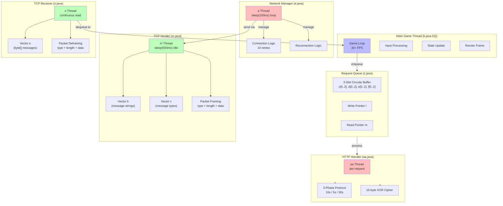

# Class Relationship Map

## Key Class Inheritance and Composition Relationships

```mermaid
classDiagram
    direction TB

    %% ======== Android Platform ========
    class Activity {
        <<Android>>
        +onCreate()
        +onDestroy()
        +onPause()
        +onResume()
    }

    class Application {
        -AppCtrl a
        +onCreate(Bundle)
        +onDestroy()
        +onPause()
        +onResume()
    }

    class SurfaceView {
        <<Android>>
    }

    class SurfaceHolderCallback {
        <<Android Interface>>
    }

    %% ======== Application Layer ========
    class AppCtrl {
        <<Runnable>>
        +static AppCtrl appcontrol
        +static Activity context
        +static bh midlet
        +static an midletview
        +static bv currentDisplayable
        +static z currentCanvas
        +run()
        +onCreate()
        +onStart()
        +onPause()
        +onDestroy()
        -loadMIDletViaReflection()
    }

    class bh {
        <<abstract>>
        -String e = "HeroCraft"
        #int c = 0
        +a(String) String
        #a()*
        #b()*
        #c()*
        #a(int) void
        +static b(String) boolean
        +static d() void
    }

    class _EMPTY_MIDLET_ {
        +a() void
        +b() void
        +c() void
        +equals(Object) boolean
    }

    %% ======== Displayable Hierarchy ========
    class bv {
        <<abstract>>
        #String aZ
        #ag ba
        #int bb
        #int bc
        #boolean bd
        +a(ad) void
        +a(ag) void
        +c(String) void
        #c(boolean) void
        #q()*
        #r()*
    }

    class z {
        <<abstract>>
        +static Object aY
        -int[][] a
        +m() void
        +n() int
        +o() int
        +p() boolean
        +g(int) int
        #b(v)*
        #d()*
    }

    class bu {
        <<abstract>>
        -static byte[] a
        -static t b
        +static a(Object) Object
        +static b(String, boolean) InputStream
        +static t() int
        +static u() Object
        +static v() Object
    }

    class bz {
        <<abstract>>
        +a(ad) void
    }

    class af {
        +items, buttons
    }

    class am {
        +empty implementations
    }

    %% ======== s0 Package (Small Screen) ========
    class s0_aow2ol {
        -k a
        -bd b
        +a() void
        +b() void
        +c() void
    }

    class s0_x {
        <<Base Game Canvas>>
        +key/touch dispatch
        +paint trigger
    }

    class s0_k {
        <<MAIN GAME CLASS>>
        ~1500 lines
        +game loop D()
        +state machine
        +all game logic
        +init a()
        +pause e()
        +destroy a(String)
    }

    class s0_a {
        <<Game State Manager>>
        +extends p
        +init game data
        +manage screens
        +AI state
        +unit/map data
    }

    class s0_p {
        <<Game Screen/State Base>>
        +screen rendering
        +network message handling
        +save/load U()/V()
    }

    class s0_w {
        <<World/Map State>>
        +unit processing
        +pathfinding
        +combat resolution
        +fog of war
        +building production
    }

    class s0_f {
        <<Font/Text Rendering>>
    }

    class s0_e {
        <<Network Manager>>
        +TCP connection mgmt
        +sender/receiver threads
        +reconnection logic
    }

    class s0_z_req {
        <<Request Queue>>
        +3-slot circular buffer
        +HTTP request processing
        +retry logic
    }

    class s0_aa {
        <<HTTP Handler>>
        +3-phase protocol
        +XOR cipher
    }

    class s0_q {
        <<Payment/Licensing>>
        +license verification
        +XOR hash of device ID
    }

    class s0_m {
        <<TCP Sender Thread>>
        +Vector message queue
        +packet framing
        +error tracking
    }

    class s0_o {
        <<TCP Receiver Thread>>
        +Vector message queue
        +packet deframing
        +error tracking
    }

    class s0_c {
        <<Game Config>>
        +HTTP URLs
        +version strings
        +RMS data
        +server config
    }

    class s0_y {
        <<Global Constants>>
        +static game data tables
        +player arrays W, X, Y
        +credit arrays
        +research arrays
    }

    class s0_i_audio {
        <<Sound System>>
        +3 audio channels
        +MIDI playback
    }

    %% ======== Renderer ========
    class an {
        <<abstract>>
        +extends SurfaceView
        +implements SurfaceHolderCallback
        #int[][] e
        +a(z) void
        +b() void
    }

    class h_renderer {
        +extends an
        +lockCanvas/unlockCanvasAndPost
        +translate/clip Canvas
    }

    %% ======== Graphics ========
    class v_graphics {
        <<abstract>>
        +drawImage()
        +drawString()
        +drawRect()
        +drawLine()
        +clipRect()
        +setClip()
    }

    class aq {
        +extends v
        +wraps android.graphics.Canvas
    }

    %% ======== UI Items ========
    class t_item {
        <<abstract>>
        +LinearLayout wrapper
        +text, commands
    }

    class b_img {
        +extends t
        +ImageView wrapper
    }

    class ak_text {
        +extends t
        +TextView wrapper
    }

    class cd_input {
        +extends t
        +EditText wrapper
    }

    class x_choice {
        +extends t
        +RadioGroup/CheckBox
    }

    class br_gauge {
        +extends t
        +progress indicator
    }

    %% ======== Connections ========
    class au_socket {
        +implements bl
        +TCP socket
    }

    class ba_http {
        +extends bt
        +implements e
        +HttpURLConnection
    }

    class r_conn {
        +Connection Factory
        +creates au or ba
    }

    %% ======== Inheritance ========
    Activity <|-- Application
    SurfaceView <|-- an
    SurfaceHolderCallback <|.. an
    an <|-- h_renderer

    bv <|-- z
    bv <|-- bz
    z <|-- bu
    bz <|-- af
    bz <|-- am

    bh <|-- _EMPTY_MIDLET_
    bh <|-- s0_aow2ol

    bu <|-- s0_x
    s0_x <|-- s0_k

    v_graphics <|-- aq
    t_item <|-- b_img
    t_item <|-- ak_text
    t_item <|-- cd_input
    t_item <|-- x_choice
    t_item <|-- br_gauge

    %% ======== Composition ========
    Application *-- AppCtrl : creates
    AppCtrl *-- an : midletview
    AppCtrl *-- bh : midlet
    AppCtrl *-- bv : currentDisplayable
    AppCtrl *-- z : currentCanvas

    s0_aow2ol *-- s0_k : main game
    s0_aow2ol *-- s0_c : config
    s0_aow2ol *-- bd : display mgr

    s0_k *-- s0_a : game state
    s0_k *-- s0_w : world state
    s0_k *-- s0_f : font system
    s0_k *-- s0_z_req : request queue
    s0_k *-- s0_aa : HTTP handler
    s0_k *-- s0_q : payment
    s0_k *-- s0_e : network manager
    s0_k *-- s0_i_audio : sound

    s0_a *-- s0_p : extends screen base

    s0_e *-- s0_m : sender thread
    s0_e *-- s0_o : receiver thread
    s0_e *-- r_conn : connection factory

    r_conn ..> au_socket : creates
    r_conn ..> ba_http : creates

    h_renderer *-- aq : graphics impl
    h_renderer *-- v_graphics : abstract graphics
```

### Resolution Variant Mapping

| s0 (≤320px portrait) | s1 (320px landscape) | s2 (>320px portrait) | Purpose |
|---|---|---|---|
| `s0.aow2ol` | `s1.aow2ol` | `s2.aow2ol` | MIDlet Entry |
| `s0.k` | `s1.c` | `s2.q` | Main Game |
| `s0.x` | `s1.i` | `s2.p` | Base Game Canvas |
| `s0.a` | `s0.a` | `s2.a` | Game State Manager |
| `s0.w` | `s0.w` | `s0.w` | World State (shared) |
| `s0.e` | `s0.e` | `s0.e` | Network (shared) |

### Network Thread Hierarchy

