# Combat System Flow

## Attack Initiation → Range Check → Projectile Spawn → Flight → Impact → Damage Calculation → Death Check

```mermaid
flowchart TD
    Start([Combat Initiated]) --> TriggerCheck{"Trigger Type?"}

    TriggerCheck -->|"Auto-engage<br/>(Idle unit detects enemy)"| AutoTarget["Auto Target Selection<br/>searchForTargets() method<br/>Search spatial hash grid<br/>8×8 buckets per player"]
    TriggerCheck -->|"Player command<br/>(Attack order)"| PlayerTarget["Player-Selected Target<br/>Set ca[unit+1919]=targetRef<br/>Set flags bits 0-2"]
    TriggerCheck -->|"Siege mode<br/>(Auto-fire)"| SiegeTarget["Siege Auto-Target<br/>flags2 bit 5 set<br/>Cannot move<br/>Extended range"]

    AutoTarget --> PriorityEval["Target Priority Evaluation"]
    PlayerTarget --> PriorityEval
    SiegeTarget --> PriorityEval

    PriorityEval --> CalcPriority{"Calculate Priority"}
    CalcPriority -->|"Building target"| BuildingPriority["Priority = bS[bT[53]+type]<br/>(= max HP value)"]
    CalcPriority -->|"Unit target"| UnitPriority["Priority based on<br/>infantry vs machinery<br/>distance class"]
    CalcPriority -->|"Closest enemy"| DistancePriority["Lowest distance class<br/>from lookup table<br/>31×31 table, upper 5 bits"]

    BuildingPriority --> RangeCheck
    UnitPriority --> RangeCheck
    DistancePriority --> RangeCheck

    RangeCheck["Range Check<br/>o() method (line 1872)"] --> GetDistance["Get Distance to Target<br/>dx = targetX - unitX<br/>dy = targetY - unitY"]

    GetDistance --> DistBounds{"|dx| > 15 or<br/>|dy| > 15?"}
    DistBounds -->|Yes| OutOfRange["Distance = 127<br/>Out of range"]
    DistBounds -->|No| LookupDist["Lookup Distance<br/>distanceTable[(dy+15)*31+dx+15]<br/>>> 3 → distance class"]

    OutOfRange --> NeedMove["Need to Move Closer<br/>Calculate path to target<br/>Set unit state = Moving"]
    LookupDist --> RangeCompare{"Distance class<br/>≤ attack range?"}
    RangeCompare -->|No| NeedMove
    RangeCompare -->|Yes| InRange["Target In Range<br/>Proceed to attack"]

    NeedMove --> PathCalc["Path Calculation<br/>c(fromX,fromY,toX,toY)<br/>Bresenham 3-candidate paths<br/>Obstacle detection<br/>Path merge"]
    PathCalc --> MoveToTarget["Move Toward Target<br/>Follow path steps<br/>Re-check range each tick"]
    MoveToTarget --> RangeCheck

    InRange --> WeaponSelect["Select Weapon Slot<br/>Up to 3 weapons<br/>flags bits 0-2"]
    WeaponSelect --> CooldownCheck{"Cooldown<br/>complete?<br/>cf[0][unitType] cycle"}
    CooldownCheck -->|No| WaitCooldown["Wait for cooldown<br/>attackCycle++<br/>Return to game loop"]
    CooldownCheck -->|Yes| FaceTarget["Face Target<br/>Update facing direction<br/>8 compass points"]

    FaceTarget --> ProjectileSpawn["Projectile Spawn<br/>a(byte,byte,int,int,...) method"]

    ProjectileSpawn --> CalcFlight["Calculate Flight Parameters"]
    CalcFlight --> CalcFlightTime["flightTime = distTable / speedTable[type]"]
    CalcFlight --> CalcVelocity["velX = startOffX / (flightTime+1)<br/>velY = startOffY / (flightTime+1)"]
    CalcFlight --> CalcStart["startOffX = (dx*30) + srcOffX - offX<br/>startOffY = (dy*20) + srcOffY - offY"]

    CalcFlight --> ProjectileType{"Projectile Type?"}
    ProjectileType -->|"Artillery (type 10)"| ArtilleryCalc["Artillery Calc<br/>Clamp velocity: velX [-15,15]<br/>velY [-10,10]<br/>Fixed flight time<br/>from at[6][59]-at[5][59]+1"]
    ProjectileType -->|"Standard"| StandardCalc["Standard Calc<br/>velocity from distance/speed<br/>variable flight time"]

    ArtilleryCalc --> SpawnEntry["Create Projectile Entry<br/>t[idx]=gridX, u[idx]=gridY<br/>A[idx]=velX, B[idx]=velY<br/>C[idx]=timeRemaining<br/>G[idx]=projectileType<br/>y[idx]=sourceUnit<br/>z[idx]=ownerPlayer<br/>x[idx]=targetUnit"]
    StandardCalc --> SpawnEntry

    SpawnEntry --> ProjectileFlight["Projectile Flight Loop<br/>Each tick:"]

    ProjectileFlight --> MoveProjectile["Move Projectile<br/>v[idx] += A[idx]  (offX += velX)<br/>w[idx] += B[idx]  (offY += velY)<br/>Convert to grid:<br/>gridX = (v[idx]+3015)/30 - 100<br/>gridY = (w[idx]+2010)/20 - 100<br/>Update t[idx], u[idx]"]
    MoveProjectile --> DecrementTime["Decrement Time<br/>C[idx]--  (time remaining)<br/>D[idx]++  (elapsed time)"]

    DecrementTime --> FlightCheck{"Flight time<br/>expired?<br/>elapsed ≥ total"}
    FlightCheck -->|No| ContinueFlight["Continue Flight<br/>Return to next tick"]
    FlightCheck -->|Yes| ImpactPhase["IMPACT PHASE"]

    ContinueFlight --> ProjectileFlight

    ImpactPhase --> ImpactType{"Projectile Type<br/>at impact?"}
    ImpactType -->|"Artillery (type 10)"| SplashDamage["SPLASH DAMAGE<br/>Area of effect calculation"]
    ImpactType -->|"Standard"| DirectDamage["DIRECT DAMAGE<br/>Single target"]

    SplashDamage --> BlastRadius["Calculate Blast Radius<br/>bS[bT[80]+attackType]"]
    BlastRadius --> AreaScan["Scan cells in radius<br/>for each dx,dy in [-radius,+radius]"]
    AreaScan --> TargetCheck{"Target at<br/>(centerX+dx, centerY+dy)?"}
    TargetCheck -->|"Enemy unit"| CalcArmour
    TargetCheck -->|"Friendly/terrain"| FriendlyFire["Friendly Fire<br/>Same damage formula<br/>Reduced by armour"]
    TargetCheck -->|"Empty"| NextCell["Skip cell"]

    DirectDamage --> TargetValid{"Valid target?"}
    TargetValid -->|"Yes"| CalcArmour
    TargetValid -->|"No"| GroundImpact["Ground Impact<br/>No effect"]

    CalcArmour["Calculate Armour<br/>l() method (line 1666)"] --> UnitTypeCheck{"Unit type?"}
    UnitTypeCheck -->|"Building (ref>100)"| ZeroArmour["Base armour = 0<br/>Buildings use HP pool"]
    UnitTypeCheck -->|"Building (ref≤0)"| BuildingArmour["Armour = N[(-ref-1)/50]<br/>Per-player building armour"]
    UnitTypeCheck -->|"Unit (1-100)"| UnitArmour["baseArmour = cf[2][unitType]<br/>Check research upgrades:<br/>if Y[player] ≥ gameTick:<br/>baseArmour += Z[player][infantry?0:1 + 4]"]

    ZeroArmour --> CalcDamage
    BuildingArmour --> CalcDamage
    UnitArmour --> CalcDamage

    CalcDamage["Calculate Damage<br/>baseDamage = cg[0][projectileType]"] --> DamageFormula["damage = baseDamage × (10 - armour) / 10<br/>damage = max(min(damage, baseDamage - armour), 1)"]

    DamageFormula --> ApplyDamage["Apply Damage<br/>ca[unit+1616] -= damage"]

    ApplyDamage --> DeathCheck{"HP ≤ 0?<br/>ca[unit+1616] ≤ 0"}
    DeathCheck -->|No| AliveContinue["Unit Survives<br/>May trigger auto-attack<br/>return to combat"]
    DeathCheck -->|Yes| UnitDies["UNIT DIES"]

    UnitDies --> MarkDying["Mark as Dying<br/>ca[unit+1616] = -1"]
    MarkDying --> DeathAnim["Death Animation<br/>Infantry: bi[attacker]+random(bd[attacker])+10-231<br/>Machinery: fixed frame 2"]
    DeathAnim --> DeathEffects["Death Effects<br/>Machinery only:<br/>- Fire (random 11-14)<br/>- Smoke (random 27-31)<br/>- Debris (6)"]
    DeathEffects --> KillReward["Kill Reward<br/>reward = (cost × 3 × dist) / (baseDist × 2)<br/>scoreReward = reward / 2<br/>W[enemy] += reward<br/>X[enemy] += scoreReward<br/>W[loser] -= scoreCost"]
    KillReward --> RemoveUnit["Remove Unit<br/>Clear occupancy grid<br/>Update spatial hash<br/>Clear path data"]

    RemoveUnit --> WinCheck{"Win Condition<br/>Check"}
    WinCheck -->|"Enemy destroyed<br/>(units=0, bldgs≤7)"| SetWinner["ab = 1 or 2<br/>(winner determined)"]
    WinCheck -->|"No win yet"| ContinueGame["Continue Game"]
    SetWinner --> GameEnd([Game End])
    ContinueGame --> ContinueGame2["Return to game loop"]
    AliveContinue --> ContinueGame2
    FriendlyFire --> NextCell
    NextCell --> AreaScan
    GroundImpact --> RemoveProjectile["Remove Projectile<br/>Free slot in array"]
    RemoveProjectile --> ContinueGame2

    %% Styling
    style Start fill:#9f9,stroke:#333
    style ImpactPhase fill:#f66,stroke:#333,stroke-width:2px
    style UnitDies fill:#f00,stroke:#333,stroke-width:2px,color:#fff
    style GameEnd fill:#f00,stroke:#333,stroke-width:2px,color:#fff
    style CalcDamage fill:#ff9,stroke:#333
    style CalcArmour fill:#9ff,stroke:#333
```

## Armour & Damage Formulas Detail

```mermaid
graph TD
    subgraph ArmourCalc["Armour Calculation (l() method)"]
        AC_Input["Input: unitRef"]
        AC_Input --> AC_Check{"unitRef > 100?"}
        AC_Check -->|Yes| AC_BuildingHP["Return 0<br/>(Building HP pool)"]
        AC_Check -->|No| AC_Check2{"unitRef ≤ 0?"}
        AC_Check2 -->|Yes| AC_BldArmour["Return N[(-ref-1)/50]<br/>(Building armour)"]
        AC_Check2 -->|No| AC_Unit["baseArmour = cf[2][unitType]"]
        AC_Unit --> AC_Upgrade{"Research active?<br/>Y[player] ≥ gameTick"}
        AC_Upgrade -->|Yes| AC_Apply["baseArmour += Z[player]<br/>[isInfantry?0:1 + 4]"]
        AC_Upgrade -->|No| AC_Return
        AC_Apply --> AC_Return["Return baseArmour"]
    end

    subgraph DamageCalc["Damage Calculation"]
        DC_Input["Input: baseDamage, armour"]
        DC_Input --> DC_Step1["Step 1: Reduce by armour<br/>dmg = base × (10-armour) / 10"]
        DC_Step1 --> DC_Step2["Step 2: Clamp<br/>dmg = max(min(dmg, base-armour), 1)"]
        DC_Step2 --> DC_Output["Output: finalDamage<br/>Minimum = 1"]
    end

    subgraph SplashCalc["Splash Damage Calculation"]
        SC_Input["Input: centerX, centerY, attackType"]
        SC_Input --> SC_Radius["radius = bS[bT[80]+attackType]"]
        SC_Radius --> SC_Loop["For each cell in radius:"]
        SC_Loop --> SC_DistFactor["distFactor = bS[bT[79]+attackType]<br/>× bS[distTable[dy][dx]] / 12"]
        SC_DistFactor --> SC_Armour["armour = getArmour(target)"]
        SC_Armour --> SC_Dmg["dmg = max(min(<br/>(10-armour)×distFactor/10,<br/>distFactor-armour), 1)"]
    end
```

### Unit Type Attack Characteristics

| Unit Type | Category | Weapon | Range | Siege Mode | Projectile |
|-----------|----------|--------|-------|------------|------------|
| 1 Infantry | Infantry | Rifle | Short | No | Bullet |
| 2 Grenadier | Infantry | Flamer | Medium | No | Bullet |
| 3 Sniper | Infantry | Sniper Rifle | Long | Yes (+range) | Bullet |
| 4 Light Assault | Light Vehicle | Machine gun | Short | No | Bullet |
| 7 Heavy Assault | Heavy Vehicle | Heavy MG | Medium | No | Bullet |
| 15 Coyote | Light Tank | Rotating gun | Medium | No | Bullet |
| 16 T-22 Zeus | Heavy Tank | Heavy cannon | Long | No | Shell |
| 17 T-21 Hammer | Medium Tank | Cannon | Medium | Yes (+dmg,+rate) | Shell |
| 18 Rhino | Medium Tank | Cannon | Medium | Yes | Shell |
| 19 AV-40 Fortress | Artillery | Rocket salvo | Extra-long | Yes (required) | Rocket |
| 20 MLRS Torrent | Artillery | Heavy rockets | Long | No | Rocket |
| 21 Armadillo | Light Vehicle | MG | Short | No | Bullet |
| 22 Porcupine | Missile System | MG + rockets | Medium | No | Rocket |
