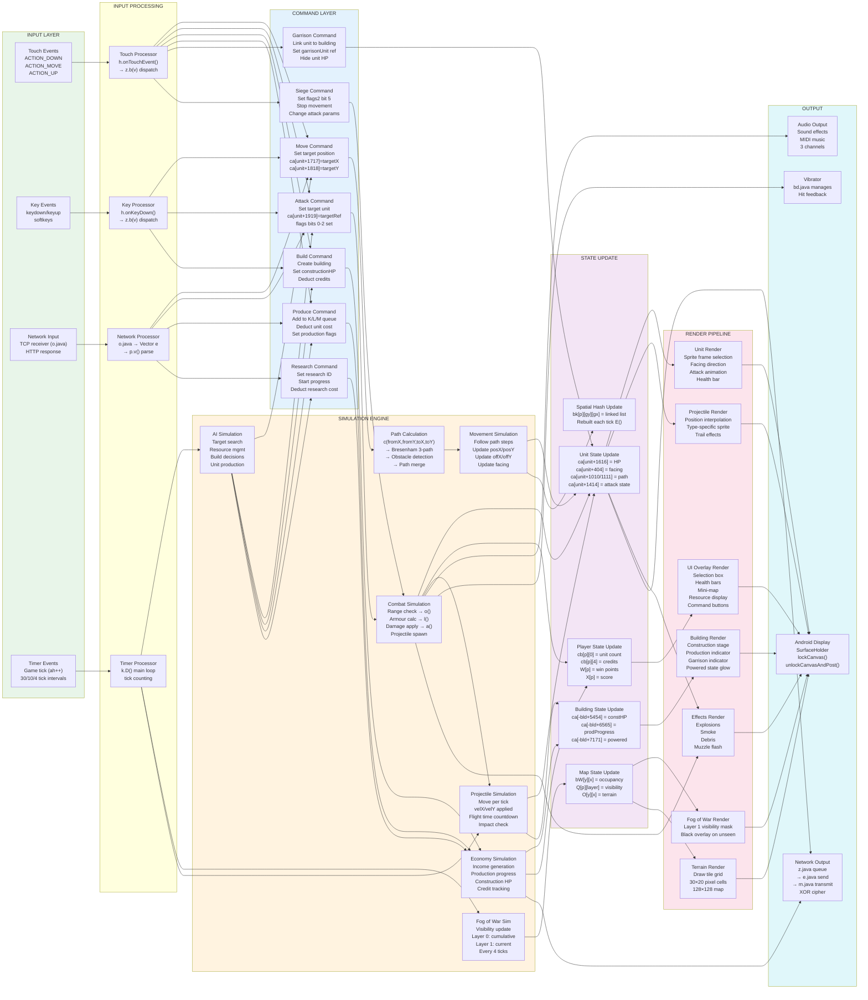
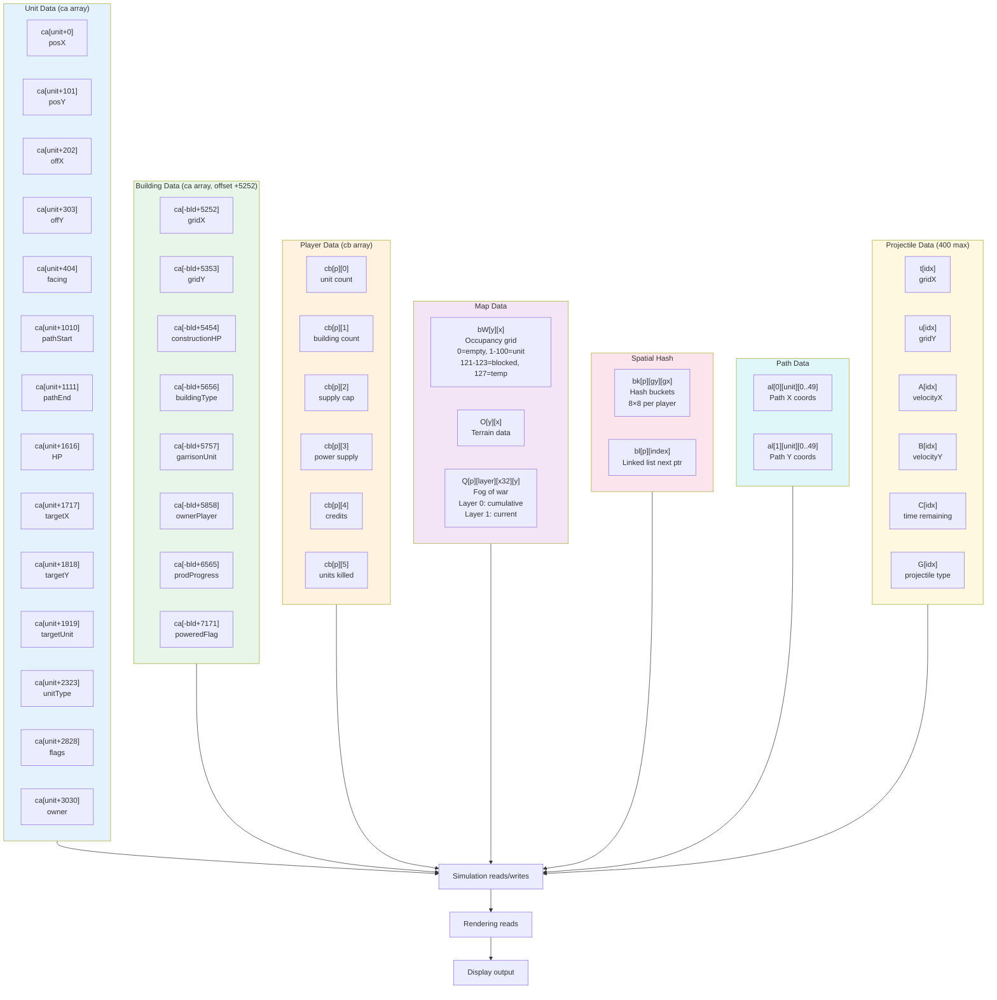

# Data Flow

## How Data Flows Through Game Systems: Input → Commands → Simulation → Rendering

```mermaid
flowchart LR
    subgraph InputLayer["INPUT LAYER"]
        Touch["Touch Events<br/>ACTION_DOWN<br/>ACTION_MOVE<br/>ACTION_UP"]
        Key["Key Events<br/>keydown/keyup<br/>softkeys"]
        NetInput["Network Input<br/>TCP receiver (o.java)<br/>HTTP response"]
        Timer["Timer Events<br/>Game tick (ah++)<br/>30/10/4 tick intervals"]
    end

    subgraph InputProcessing["INPUT PROCESSING"]
        TouchProc["Touch Processor<br/>h.onTouchEvent()<br/>→ z.b(v) dispatch"]
        KeyProc["Key Processor<br/>h.onKeyDown()<br/>→ z.b(v) dispatch"]
        NetProc["Network Processor<br/>o.java → Vector e<br/>→ p.v() parse"]
        TimerProc["Timer Processor<br/>k.D() main loop<br/>tick counting"]
    end

    subgraph CommandLayer["COMMAND LAYER"]
        MoveCmd["Move Command<br/>Set target position<br/>ca[unit+1717]=targetX<br/>ca[unit+1818]=targetY"]
        AttackCmd["Attack Command<br/>Set target unit<br/>ca[unit+1919]=targetRef<br/>flags bits 0-2 set"]
        BuildCmd["Build Command<br/>Create building<br/>Set constructionHP<br/>Deduct credits"]
        ProduceCmd["Produce Command<br/>Add to K/L/M queue<br/>Deduct unit cost<br/>Set production flags"]
        ResearchCmd["Research Command<br/>Set research ID<br/>Start progress<br/>Deduct research cost"]
        GarrisonCmd["Garrison Command<br/>Link unit to building<br/>Set garrisonUnit ref<br/>Hide unit HP"]
        SiegeCmd["Siege Command<br/>Set flags2 bit 5<br/>Stop movement<br/>Change attack params"]
    end

    subgraph Simulation["SIMULATION ENGINE"]
        PathCalc["Path Calculation<br/>c(fromX,fromY,toX,toY)<br/>→ Bresenham 3-path<br/>→ Obstacle detection<br/>→ Path merge"]
        MoveSim["Movement Simulation<br/>Follow path steps<br/>Update posX/posY<br/>Update offX/offY<br/>Update facing"]
        CombatSim["Combat Simulation<br/>Range check → o()<br/>Armour calc → l()<br/>Damage apply → a()<br/>Projectile spawn"]
        AISim["AI Simulation<br/>Target search<br/>Resource mgmt<br/>Build decisions<br/>Unit production"]
        EconomySim["Economy Simulation<br/>Income generation<br/>Production progress<br/>Construction HP<br/>Credit tracking"]
        FogSim["Fog of War Sim<br/>Visibility update<br/>Layer 0: cumulative<br/>Layer 1: current<br/>Every 4 ticks"]
        ProjectileSim["Projectile Simulation<br/>Move per tick<br/>velX/velY applied<br/>Flight time countdown<br/>Impact check"]
    end

    subgraph StateUpdate["STATE UPDATE"]
        UnitState["Unit State Update<br/>ca[unit+1616] = HP<br/>ca[unit+404] = facing<br/>ca[unit+1010/1111] = path<br/>ca[unit+1414] = attack state"]
        BuildState["Building State Update<br/>ca[-bld+5454] = constHP<br/>ca[-bld+6565] = prodProgress<br/>ca[-bld+7171] = powered"]
        PlayerState["Player State Update<br/>cb[p][0] = unit count<br/>cb[p][4] = credits<br/>W[p] = win points<br/>X[p] = score"]
        MapState["Map State Update<br/>bW[y][x] = occupancy<br/>Q[p][layer] = visibility<br/>O[y][x] = terrain"]
        SpatialUpdate["Spatial Hash Update<br/>bk[p][gy][gx] = linked list<br/>Rebuilt each tick E()"]
    end

    subgraph RenderPipeline["RENDER PIPELINE"]
        FogRender["Fog of War Render<br/>Layer 1 visibility mask<br/>Black overlay on unseen"]
        TerrainRender["Terrain Render<br/>Draw tile grid<br/>30×20 pixel cells<br/>128×128 map"]
        BuildingRender["Building Render<br/>Construction stage<br/>Production indicator<br/>Garrison indicator<br/>Powered state glow"]
        UnitRender["Unit Render<br/>Sprite frame selection<br/>Facing direction<br/>Attack animation<br/>Health bar"]
        ProjectileRender["Projectile Render<br/>Position interpolation<br/>Type-specific sprite<br/>Trail effects"]
        UIRender["UI Overlay Render<br/>Selection box<br/>Health bars<br/>Mini-map<br/>Resource display<br/>Command buttons"]
        EffectsRender["Effects Render<br/>Explosions<br/>Smoke<br/>Debris<br/>Muzzle flash"]
    end

    subgraph Output["OUTPUT"]
        Display["Android Display<br/>SurfaceHolder<br/>lockCanvas()<br/>unlockCanvasAndPost()"]
        AudioOut["Audio Output<br/>Sound effects<br/>MIDI music<br/>3 channels"]
        NetOutput["Network Output<br/>z.java queue<br/>→ e.java send<br/>→ m.java transmit<br/>XOR cipher"]
        Vibrator["Vibrator<br/>bd.java manages<br/>Hit feedback"]
    end

    %% Input → Processing
    Touch --> TouchProc
    Key --> KeyProc
    NetInput --> NetProc
    Timer --> TimerProc

    %% Processing → Commands
    TouchProc --> MoveCmd
    TouchProc --> AttackCmd
    TouchProc --> BuildCmd
    TouchProc --> ProduceCmd
    TouchProc --> GarrisonCmd
    TouchProc --> SiegeCmd
    KeyProc --> MoveCmd
    KeyProc --> AttackCmd
    KeyProc --> BuildCmd
    NetProc --> MoveCmd
    NetProc --> AttackCmd
    NetProc --> ProduceCmd
    NetProc --> ResearchCmd

    %% Commands → Simulation
    MoveCmd --> PathCalc
    AttackCmd --> CombatSim
    BuildCmd --> EconomySim
    ProduceCmd --> EconomySim
    ResearchCmd --> EconomySim
    GarrisonCmd --> UnitState
    SiegeCmd --> CombatSim
    TimerProc --> AISim
    TimerProc --> FogSim
    TimerProc --> ProjectileSim

    %% Simulation → State
    PathCalc --> MoveSim
    MoveSim --> UnitState
    MoveSim --> SpatialUpdate
    CombatSim --> UnitState
    CombatSim --> PlayerState
    CombatSim --> ProjectileSim
    AISim --> MoveCmd
    AISim --> AttackCmd
    AISim --> BuildCmd
    AISim --> ProduceCmd
    AISim --> ResearchCmd
    EconomySim --> BuildState
    EconomySim --> PlayerState
    FogSim --> MapState
    ProjectileSim --> UnitState
    ProjectileSim --> BuildState

    %% State → Render
    MapState --> FogRender
    MapState --> TerrainRender
    BuildState --> BuildingRender
    UnitState --> UnitRender
    UnitState --> ProjectileRender
    PlayerState --> UIRender
    UnitState --> EffectsRender

    %% Render → Output
    FogRender --> Display
    TerrainRender --> Display
    BuildingRender --> Display
    UnitRender --> Display
    ProjectileRender --> Display
    UIRender --> Display
    EffectsRender --> Display

    %% Cross-cutting outputs
    CombatSim --> AudioOut
    CombatSim --> Vibrator
    CombatSim --> EffectsRender
    EconomySim --> NetOutput
    UnitState --> NetOutput

    style InputLayer fill:#e8f5e9
    style CommandLayer fill:#e3f2fd
    style Simulation fill:#fff3e0
    style StateUpdate fill:#f3e5f5
    style RenderPipeline fill:#fce4ec
    style Output fill:#e0f7fa
```

## Data Array Architecture

```mermaid
graph TD
    subgraph UnitData["Unit Data (ca array)"]
        direction LR
        U0["ca[unit+0]<br/>posX"]
        U101["ca[unit+101]<br/>posY"]
        U202["ca[unit+202]<br/>offX"]
        U303["ca[unit+303]<br/>offY"]
        U404["ca[unit+404]<br/>facing"]
        U1010["ca[unit+1010]<br/>pathStart"]
        U1111["ca[unit+1111]<br/>pathEnd"]
        U1616["ca[unit+1616]<br/>HP"]
        U1717["ca[unit+1717]<br/>targetX"]
        U1818["ca[unit+1818]<br/>targetY"]
        U1919["ca[unit+1919]<br/>targetUnit"]
        U2323["ca[unit+2323]<br/>unitType"]
        U2828["ca[unit+2828]<br/>flags"]
        U3030["ca[unit+3030]<br/>owner"]
    end

    subgraph BuildingData["Building Data (ca array, offset +5252)"]
        direction LR
        B5252["ca[-bld+5252]<br/>gridX"]
        B5353["ca[-bld+5353]<br/>gridY"]
        B5454["ca[-bld+5454]<br/>constructionHP"]
        B5656["ca[-bld+5656]<br/>buildingType"]
        B5757["ca[-bld+5757]<br/>garrisonUnit"]
        B5858["ca[-bld+5858]<br/>ownerPlayer"]
        B6565["ca[-bld+6565]<br/>prodProgress"]
        B7171["ca[-bld+7171]<br/>poweredFlag"]
    end

    subgraph PlayerData["Player Data (cb array)"]
        direction LR
        P0["cb[p][0]<br/>unit count"]
        P1["cb[p][1]<br/>building count"]
        P2["cb[p][2]<br/>supply cap"]
        P3["cb[p][3]<br/>power supply"]
        P4["cb[p][4]<br/>credits"]
        P5["cb[p][5]<br/>units killed"]
    end

    subgraph MapData["Map Data"]
        direction LR
        BW["bW[y][x]<br/>Occupancy grid<br/>0=empty, 1-100=unit<br/>121-123=blocked, 127=temp"]
        O_map["O[y][x]<br/>Terrain data"]
        Q_fog["Q[p][layer][x32][y]<br/>Fog of war<br/>Layer 0: cumulative<br/>Layer 1: current"]
    end

    subgraph SpatialData["Spatial Hash"]
        direction LR
        BK["bk[p][gy][gx]<br/>Hash buckets<br/>8×8 per player"]
        BL["bl[p][index]<br/>Linked list next ptr"]
    end

    subgraph PathData["Path Data"]
        direction LR
        AL0["al[0][unit][0..49]<br/>Path X coords"]
        AL1["al[1][unit][0..49]<br/>Path Y coords"]
    end

    subgraph ProjectileData["Projectile Data (400 max)"]
        direction LR
        PR_t["t[idx]<br/>gridX"]
        PR_u["u[idx]<br/>gridY"]
        PR_A["A[idx]<br/>velocityX"]
        PR_B["B[idx]<br/>velocityY"]
        PR_C["C[idx]<br/>time remaining"]
        PR_G["G[idx]<br/>projectile type"]
    end

    UnitData --> Simulation["Simulation reads/writes"]
    BuildingData --> Simulation
    PlayerData --> Simulation
    MapData --> Simulation
    SpatialData --> Simulation
    PathData --> Simulation
    ProjectileData --> Simulation

    Simulation --> Rendering["Rendering reads"]
    Rendering --> Display["Display output"]

    style UnitData fill:#e3f2fd
    style BuildingData fill:#e8f5e9
    style PlayerData fill:#fff3e0
    style MapData fill:#f3e5f5
    style SpatialData fill:#fce4ec
    style PathData fill:#e0f7fa
    style ProjectileData fill:#fff8e1
```
