# Game Runtime Flow

## Complete Flow from App Launch through Gameplay

```mermaid
flowchart TD
    Start([App Launch]) --> AppCreate["Application.onCreate()<br/>Create AppCtrl(this)"]
    AppCreate --> AppCtrlInit["AppCtrl.onCreate()<br/>- Request fullscreen<br/>- Set window flags<br/>- Determine screen size<br/>- Select s0/s1/s2 package"]

    AppCtrlInit --> ScreenSelect{"Screen Width?"}
    ScreenSelect -->|"≤320px portrait"| S0["Package: s0<br/>a = s0 prefix<br/>orientation = portrait"]
    ScreenSelect -->|"320px landscape"| S1["Package: s1<br/>a = s1 prefix<br/>orientation = landscape"]
    ScreenSelect -->|">320px portrait"| S2["Package: s2<br/>a = s2 prefix<br/>orientation = portrait"]

    S0 --> CreateView
    S1 --> CreateView
    S2 --> CreateView

    CreateView["Create SurfaceView<br/>midletview = new h(context)<br/>Set as content view"]
    CreateView --> InitSystems["Initialize Systems<br/>- Create LinearLayout for ads<br/>- Set system properties<br/>- Init Google Analytics<br/>- Check billing service"]

    InitSystems --> StartThread["AppCtrl.run()<br/>New Thread(this)<br/>Priority: 10"]
    StartThread --> WaitSurface["Wait for surface ready<br/>while !midletview.a<br/>sleep(200ms)"]
    WaitSurface --> Gc["System.gc()"]

    Gc --> LoadMIDlet["Load MIDlet via Reflection<br/>Class.forName(package + '.aow2ol')<br/>Verify vendor = 'HeroCraft'"]

    LoadMIDlet --> MIDletInit["s0.aow2ol.a()<br/>Initialize game"]
    MIDletInit --> InitConfig["c.a(this)<br/>Load config/resources"]
    InitConfig --> InitDisplay["bd.a()<br/>Get Display Manager"]
    InitDisplay --> CreateMainGame["new k(this)<br/>Create Main Game (s0.k)"]

    CreateMainGame --> GameInit["k.a() - Game Initialization"]
    GameInit --> InitSubsystems["Initialize Subsystems"]
    InitSubsystems --> InitGameState["new a() - Game State<br/>new w() - World State<br/>new f() - Font System"]
    InitSubsystems --> InitNetwork["new z() - Request Queue<br/>new aa() - HTTP Handler<br/>new q() - Payment Info<br/>new e() - Network Manager"]
    InitSubsystems --> InitAudio["s0.i - Sound System<br/>Load MIDI music"]
    InitSubsystems --> LoadRMS["Load RMS Data<br/>- Player ID<br/>- Settings<br/>- Payment state"]

    InitSubsystems --> SetReady["midlet.a(1)<br/>bStateReady = true"]
    SetReady --> MainLoop

    MainLoop(["k.D() - Main Game Loop<br/>Runs continuously"])
    MainLoop --> CheckPause{"Paused?"}
    CheckPause -->|Yes| WaitResume["Wait for resume<br/>sleep(100ms)"]
    WaitResume --> CheckPause

    CheckPause -->|No| CheckState{"Game Mode (c)?"}

    CheckState -->|"c=0<br/>Connecting"| ConnectPhase["Connecting Phase<br/>- Initiate TCP connection<br/>- Send login message<br/>- Wait for SESSION_INIT (type 4)"]
    CheckState -->|"c=1<br/>Pre-game"| PreGamePhase["Pre-game Phase<br/>- Load map data<br/>- Setup AI<br/>- Initialize units<br/>- Process events"]
    CheckState -->|"c=3<br/>In-game"| InGamePhase["In-game Phase<br/>- Process game tick<br/>- Run AI<br/>- Handle combat<br/>- Update world"]
    CheckState -->|"c=2<br/>Unused"| CheckState

    ConnectPhase --> ScreenState{"Screen State (aO)?"}
    PreGamePhase --> ScreenState
    InGamePhase --> ScreenState

    ScreenState -->|"aO=0/7<br/>Main Menu"| MainMenu["Main Menu Screen<br/>- Display splash/intro<br/>- User selects mode<br/>- Campaign / Online / Skirmish"]
    ScreenState -->|"aO=8<br/>Login"| Login["Login Screen<br/>- Construct login string<br/>- e.a(hostname, type)<br/>- TCP connect"]
    ScreenState -->|"aO=14<br/>Lobby"| Lobby["Lobby Screen<br/>- Room list<br/>- Player info<br/>- Create/Join room"]
    ScreenState -->|"aO=16<br/>Room"| Room["Game Room<br/>- Chat<br/>- Match settings<br/>- Ready/Start"]
    ScreenState -->|"aO=55/56<br/>Searching"| Searching["Matchmaking Search<br/>- Send match request<br/>- Wait for MATCH_START"]
    ScreenState -->|"aO=31<br/>Wait"| MatchWait["Match Wait<br/>- Loading map<br/>- Sync game state"]
    ScreenState -->|"aO=17<br/>Game View"| GameView["Game Screen<br/>- Render map<br/>- Handle input<br/>- Process commands"]
    ScreenState -->|"aO=41<br/>Result"| Result["Game Result<br/>- Display scores<br/>- Credits earned<br/>- Return to lobby"]
    ScreenState -->|"aO=63<br/>Error"| Error["Error Screen<br/>- Connection lost<br/>- Timeout<br/>- Return to menu"]

    MainMenu -->|"Online Game"| Login
    Login -->|"SESSION_INIT"| Lobby
    Lobby -->|"Create/Join Room"| Room
    Room -->|"Find Match"| Searching
    Searching -->|"MATCH_START (type 12)"| MatchWait
    MatchWait -->|"GAME_STATE (type 30)"| GameView
    GameView -->|"GAME_RESULT (type 33)"| Result
    Result -->|"Continue"| Lobby
    Error -->|"Retry"| MainMenu

    InGamePhase --> GameTick["Game Tick Processing<br/>Every 30 ticks: reset battle flag<br/>Every 10 ticks: process timed events<br/>Every 4 ticks: update fog of war"]

    GameTick --> ProcessPlayers["For each player (0..1):<br/>Process all units (50 per player)"]
    ProcessPlayers --> ProcessUnit["Process Unit Behavior<br/>- State machine<br/>- Movement<br/>- Attack<br/>- Production"]

    ProcessUnit --> ProcessBuildings["Process Buildings<br/>- Resource generation<br/>- Production progress<br/>- Garrison management"]

    ProcessBuildings --> CheckWin{"Win Condition?"}
    CheckWin -->|"Enemy destroyed<br/>ab=1 or ab=2"| EndGame["Set win state<br/>Calculate scores"]
    CheckWin -->|"Time expired"| TimeWin["Compare scores<br/>Set winner"]
    CheckWin -->|"No"| RenderFrame

    RenderFrame["Render Frame<br/>1. Clear canvas<br/>2. Draw terrain<br/>3. Draw buildings<br/>4. Draw units<br/>5. Draw projectiles<br/>6. Draw UI overlay<br/>7. Draw fog of war<br/>8. Swap buffers"]

    RenderFrame --> SyncCheck{"Online Mode?<br/>Sync needed?"}
    SyncCheck -->|"Yes"| SendState["Send game state<br/>via z.java queue"]
    SyncCheck -->|"No"| MainLoop
    SendState --> MainLoop

    EndGame --> MainLoop
    TimeWin --> MainLoop

    style Start fill:#9f9,stroke:#333
    style MainLoop fill:#bbf,stroke:#333,stroke-width:3px
    style GameTick fill:#fdb,stroke:#333
    style RenderFrame fill:#bfb,stroke:#333
    style CheckState fill:#fbb,stroke:#333
```



### Game Tick Timing

```mermaid
sequenceDiagram
    participant Loop as Game Loop (k.D)
    participant Tick as Game Tick
    participant AI as AI System
    participant World as World State (w)
    participant Render as Renderer

    loop Every Frame (~33ms at 30 FPS)
        Loop->>Tick: Advance tick counter (ah++)
        
        alt Every 30 ticks
            Tick->>World: Reset battle flag (bJ=0)
        end
        
        alt Every 10 ticks
            Tick->>World: Process timed events (d())
        end
        
        alt Every 4 ticks
            Tick->>World: Update fog of war (e())
        end
        
        Tick->>World: Process Player 0 units
        Tick->>World: Process Player 1 units
        Tick->>World: Process buildings (r())
        Tick->>AI: AI decision making
        
        alt Online mode - sync interval reached
            Tick->>Tick: Send state to server
            Tick->>Tick: Wait for GAME_STATE
        end
        
        Tick->>Render: Draw frame
        Render->>Loop: Frame complete
    end
```
