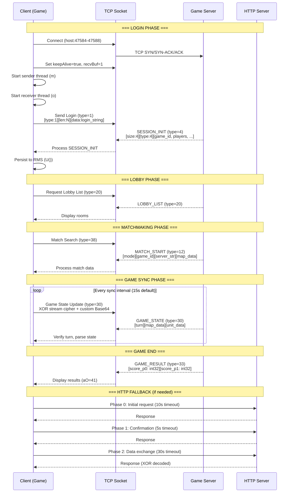

# Network Session Lifecycle

## Login → Lobby → Matchmaking → Game → Result Flow

```mermaid
stateDiagram-v2
    direction TB

    [*] --> AppLaunch : Application.onCreate()

    state "App Launch" as AppLaunch {
        [*] --> InitAppCtrl
        InitAppCtrl --> DetermineScreen : Select s0/s1/s2
        DetermineScreen --> LoadMIDlet : Reflection load
        LoadMIDlet --> InitGame : k.a()
        InitGame --> LoadSaveData : V() from RMS
        LoadSaveData --> MainMenuReady
    }

    AppLaunch --> MainMenu : aO = 0/7

    state "Main Menu" as MainMenu {
        [*] --> DisplaySplash
        DisplaySplash --> WaitForInput
        WaitForInput --> CampaignSelected : "Campaign"
        WaitForInput --> OnlineSelected : "Online Game"
        WaitForInput --> SkirmishSelected : "Skirmish"
        WaitForInput --> SettingsSelected : "Settings"
        WaitForInput --> EditorSelected : "Map Editor (aO=60)"
    }

    MainMenu --> Login : "Online Game"
    MainMenu --> CampaignGame : "Campaign"

    state "Login & Connect" as Login {
        [*] --> ConstructLogin
        ConstructLogin --> ReadPlayerID["Read Player ID<br/>RMS 'new_id' or file 'f'"]
        ReadPlayerID --> ValidateLicense["Validate License<br/>q.java XOR hash check"]
        ValidateLicense --> SelectServer["Select Server<br/>artofwaronline.herocraft.com<br/>or aow2.ru"]
        SelectServer --> TCPSocket["Create TCP Socket<br/>port = 47584 + random()%5"]
        TCPSocket --> SetSocketOpts["Set Socket Options<br/>keepAlive = true<br/>recvBufSize = 1"]
        SetSocketOpts --> StartThreads["Start Sender (m)<br/>Start Receiver (o)"]
        StartThreads --> SendLoginMsg["Send Login Message<br/>type = 1"]
        SendLoginMsg --> WaitSessionInit["Wait for SESSION_INIT<br/>type = 4"]

        WaitSessionInit --> ProcessSessionInit : Received
        ProcessSessionInit --> ParseSessionData["Parse Session Data<br/>- Game ID<br/>- Player count<br/>- Player IDs<br/>- Income/Expenses<br/>- Production levels<br/>- Alliance data<br/>- Feature flags"]
        ParseSessionData --> PersistSession["Persist to RMS<br/>U() method"]
        PersistSession --> LoginComplete
    }

    Login --> Lobby : aO = 14
    Login --> Error : Connection failed

    state "Lobby" as Lobby {
        [*] --> RequestLobbyList["Request Room List<br/>type = 20/102"]
        RequestLobbyList --> DisplayRooms["Display Rooms<br/>Player counts<br/>Room status"]
        DisplayRooms --> LobbyAction{"User Action?"}
        LobbyAction --> CreateRoom["Create Room<br/>aO → 16"]
        LobbyAction --> JoinRoom["Join Room<br/>aO → 16"]
        LobbyAction --> ViewRank["View Rankings<br/>type = 70<br/>aO → 54"]
        LobbyAction --> OpenChat["Open Chat<br/>aO → 9/10/11"]
        LobbyAction --> ViewProfile["View Profile<br/>aO → 48"]
        LobbyAction --> OpenShop["Open Shop<br/>aO → 47"]
        LobbyAction --> ManageClan["Manage Clan<br/>aO → 57"]
    }

    Lobby --> GameRoom : Create/Join room
    Lobby --> Error : Error response

    state "Game Room" as GameRoom {
        [*] --> InRoom["In Room<br/>aO = 16<br/>Chat with players<br/>Set match params"]
        InRoom --> RoomAction{"User Action?"}
        RoomAction --> StartSearch["Start Match Search<br/>type = 38 (search)<br/>type = 36 (quick match)"]
        RoomAction --> LeaveRoom["Leave Room<br/>Back to Lobby"]
    }

    GameRoom --> Matchmaking : Start search
    GameRoom --> Lobby : Leave room

    state "Matchmaking" as Matchmaking {
        [*] --> Searching["Searching...<br/>aO = 55/56<br/>Send match request"]
        Searching --> WaitMatchStart["Wait for MATCH_START<br/>type = 12"]
        WaitMatchStart --> ProcessMatch["Process Match Data<br/>- Game mode<br/>- Game ID<br/>- Server string<br/>- Map data blob"]
        ProcessMatchStart --> MatchReady
    }

    Matchmaking --> MatchWait : Match found
    Matchmaking --> Error : Matchmaking error (-2)

    state "Match Wait / Loading" as MatchWait {
        [*] --> LoadingMap["Loading Map<br/>aO = 31<br/>Parse map data"]
        LoadingMap --> InitGameState["Initialize Game State<br/>- Create units<br/>- Set positions<br/>- Init fog of war"]
        InitGameState --> WaitSync["Wait for GAME_STATE<br/>type = 30"]
        WaitSync --> SyncComplete["Sync Complete<br/>Turn number verified<br/>c = 3 (In-game)"]
    }

    MatchWait --> InGame : Sync complete
    MatchWait --> Error : Sync timeout

    state "In-Game" as InGame {
        [*] --> GameActive["Game Active<br/>aO = 17/18/19/20/22<br/>Real-time gameplay"]
        GameActive --> GameLoop["Game Loop<br/>- Process input<br/>- Run AI<br/>- Update combat<br/>- Render frame"]
        GameLoop --> SyncCheck{"Sync interval<br/>reached?"}
        SyncCheck -->|Yes| SendUpdate["Send Game Update<br/>via z.java queue<br/>XOR stream cipher"]
        SyncCheck -->|No| GameLoop
        SendUpdate --> WaitAck["Wait for<br/>GAME_STATE response"]
        WaitAck --> GameLoop

        GameActive --> Disconnection{"Connection lost?"}
        Disconnection -->|Yes, ≤3 errors| Retry["Retry (up to 3x)"]
        Disconnection -->|Yes, >3 errors| Error
        Retry -->|Success| GameActive
        Retry -->|Fail| Error
    }

    InGame --> GameResult : GAME_RESULT (type 33)
    InGame --> Error : Disconnected

    state "Game Result" as GameResult {
        [*] --> DisplayScores["Display Scores<br/>aO = 41<br/>Player 0 score: W[0]<br/>Player 1 score: W[1]"]
        DisplayScores --> CalcRewards["Calculate Rewards<br/>- Credits earned<br/>- Score earned<br/>- Kill rewards"]
        CalcRewards --> ShowResults["Show Results<br/>aO = 33 (score screen)"]
    }

    GameResult --> Lobby : Continue
    GameResult --> MainMenu : Exit

    state "Error Recovery" as Error {
        [*] --> DetermineError["Determine Error Type"]
        DetermineError --> ConnError["Connection Error (-5)<br/>Socket failure"]
        DetermineError --> TimeoutError["Timeout Error (-8)<br/>Sync timeout"]
        DetermineError --> MatchError["Matchmaking Error (-2)<br/>No match found"]
        DetermineError --> AuthError["Auth Error<br/>Invalid session"]

        ConnError --> Reconnect["Attempt Reconnect<br/>Up to 10 retries"]
        TimeoutError --> Reconnect
        MatchError --> BackToLobby["Return to Lobby<br/>aO = 14"]
        AuthError --> BackToLogin["Return to Login<br/>aO = 8"]

        Reconnect -->|Success| InGame
        Reconnect -->|Fail| ShowError["Show Error Screen<br/>aO = 63<br/>y.u = error code"]
    }

    Error --> MainMenu : User dismisses
    Error --> Lobby : BackToLobby

    state "Campaign Game" as CampaignGame {
        [*] --> SelectEpisode["Select Episode<br/>EP1: Global Confederation<br/>EP2: Liberation of Peru"]
        SelectEpisode --> SelectMission["Select Mission<br/>7 per episode"]
        SelectMission --> LoadMission["Load Mission<br/>Map data from assets"]
        LoadMission --> RunCampaign["Run Campaign Game<br/>AI opponent<br/>Timed events system"]
    end

    CampaignGame --> MainMenu : Mission complete/exit

    %% Styling
    note right of Login : TCP connect + auth
    note right of Matchmaking : Server-authoritative lockstep
    note right of InGame : Server validates all state changes
```

## Network Protocol Sequence



### Screen State Transition Table

| From (aO) | To (aO) | Trigger | Network Message |
|-----------|---------|---------|-----------------|
| 0/7 (Menu) | 8 (Login) | User selects Online | TCP connect |
| 8 (Login) | 14 (Lobby) | SESSION_INIT (type 4) | Server → Client |
| 14 (Lobby) | 16 (Room) | User creates/joins | Room request |
| 16 (Room) | 55/56 (Search) | User starts search | Match search (type 38) |
| 55/56 (Search) | 31 (Wait) | MATCH_START (type 12) | Server → Client |
| 31 (Wait) | 17-22 (Game) | GAME_STATE (type 30) | Server → Client |
| 17-22 (Game) | 41 (Result) | GAME_RESULT (type 33) | Server → Client |
| 41 (Result) | 14 (Lobby) | User continues | - |
| Any | 63 (Error) | Connection error | Error codes -2, -5, -8 |
| 63 (Error) | 0/7 (Menu) | User dismisses | - |
