# System Map

## Comprehensive System Map Showing All System Interactions

```mermaid
graph TB
    subgraph Android["ANDROID PLATFORM"]
        Activity["Activity<br/>(Application.java)"]
        Surface["SurfaceView<br/>(an → h)"]
        CanvasAPI["android.graphics.Canvas"]
        VibratorSvc["Vibrator Service"]
        Telephony["TelephonyManager"]
        SharedPrefs["SharedPreferences"]
    end

    subgraph Core["CORE ENGINE"]
        AppCtrl["AppCtrl<br/>Main Thread P10<br/>Runnable loop"]
        MIDlet["bh (MIDlet)<br/>→ _EMPTY_MIDLET_<br/>→ s0.aow2ol"]
        ScreenSelect["Screen Selector<br/>bb.java<br/>s0 ≤320px | s1 =320px | s2 >320px"]
    end

    subgraph GameEngine["GAME ENGINE (s0.k)"]
        GameLoop["Game Loop D()"]
        TickMgr["Tick Manager<br/>ah++ per frame<br/>30/10/4 tick intervals"]
        ScreenState["Screen State Machine<br/>aO values<br/>0-125 states"]
        GameMode["Game Mode<br/>c=0: Connecting<br/>c=1: Pre-game<br/>c=3: In-game"]
        InputHandler["Input Handler<br/>Touch/Key dispatch"]
        SaveMgr["Save Manager<br/>U() save / V() load<br/>RMS: aow2olhc"]
    end

    subgraph WorldSystem["WORLD SYSTEM (w.java)"]
        WorldState["World State<br/>128×128 tile grid<br/>30×20 px cells"]
        UnitMgr["Unit Manager<br/>100 units max<br/>50 per player<br/>ca[] array"]
        BuildingMgr["Building Manager<br/>ca[] array offset +5252<br/>constructionHP system"]
        ProjectileMgr["Projectile Manager<br/>400 max active<br/>velocity-based flight"]
        PlayerMgr["Player Manager<br/>cb[] player arrays<br/>W/X/Y/Z scoring"]
        OccupancyGrid["Occupancy Grid<br/>bW[y][x]<br/>0=empty, 1-100=unit<br/>121-123=blocked"]
        SpatialHash["Spatial Hash<br/>bk[p][8][8] buckets<br/>bl[p] linked lists<br/>Rebuilt each tick"]
        FogOfWar["Fog of War<br/>Q[p][2][x32][y]<br/>Layer 0: cumulative<br/>Layer 1: current"]
        MapData["Map Data<br/>Terrain tiles<br/>Resource nodes<br/>Decorations"]
    end

    subgraph AISystem["AI SYSTEM"]
        AILoop["AI Decision Loop<br/>Runs during control phase<br/>ac==0"]
        TargetSearch["Target Search<br/>spatial hash scan<br/>priority evaluation<br/>distance class check"]
        PathPlanner["Path Planner<br/>3-candidate Bresenham<br/>Obstacle detection<br/>Path merge/optimization"]
        BuildPlanner["Build Planner<br/>Timed event system<br/>Credit management<br/>Queue optimization"]
        SiegeLogic["Siege Logic<br/>Auto-siege on enemy near<br/>Range/damage increase<br/>Immobile during siege"]
        GarrisonLogic["Garrison Logic<br/>Bunker/tower entry<br/>Cooldown management<br/>Enhanced fire rate"]
        ResourceMgmt["Resource Management<br/>Income per 127 ticks<br/>Production speed scaling<br/>Credit limit tracking"]
    end

    subgraph CombatSystem["COMBAT SYSTEM"]
        RangeCheck["Range Check<br/>31×31 lookup table<br/>Distance class (upper 5 bits)<br/>Terrain cost (lower 3 bits)"]
        ArmourCalc["Armour Calc<br/>cf[2][type] base<br/>Research bonuses<br/>Building armour array"]
        DamageCalc["Damage Calc<br/>dmg = base×(10-arm)/10<br/>Clamped: max(min, 1)"]
        ProjectileSys["Projectile System<br/>Spawn with velocity<br/>Pixel movement per tick<br/>Grid conversion"]
        SplashSys["Splash System<br/>Artillery type 10<br/>Blast radius scan<br/>Distance-based falloff"]
        DeathSys["Death System<br/>HP = -1 marker<br/>Infantry/Machinery anim<br/>Kill reward calculation<br/>Score + credit updates"]
        WeaponSys["Weapon System<br/>Up to 3 weapons<br/>Cooldown cycling<br/>Attack cycle counter"]
    end

    subgraph EconomySystem["ECONOMY SYSTEM"]
        CreditSys["Credit System<br/>cb[player][4]<br/>Cap: 30,000<br/>Auto-generation"]
        IncomeSys["Income System<br/>Command Centre base<br/>70% of base per cycle<br/>127-tick generation cycle"]
        ProductionSys["Production System<br/>K/L/M queues (60 slots)<br/>Sequential processing<br/>Rally point assignment"]
        ResearchSys["Research System<br/>48 research IDs<br/>One at a time<br/>g(int i) method applies"]
        BuildCostSys["Build Cost System<br/>(baseCost × modifier) / 10<br/>× 20 / (upgrade + 20)"]
        PowerSys["Power System<br/>Generator buildings<br/>Power radius<br/>Unpowered = inactive"]
    end

    subgraph NetworkSystem["NETWORK SYSTEM"]
        NetMgr["Network Manager (e)<br/>Connection lifecycle<br/>10-retry reconnection<br/>sleep(100ms) loop"]
        SenderThread["Sender Thread (m)<br/>Vector queue<br/>Packet framing<br/>sleep(100ms) rate limit"]
        ReceiverThread["Receiver Thread (o)<br/>Vector queue<br/>Packet deframing<br/>3-error disconnect"]
        RequestQueue["Request Queue (z)<br/>3-slot circular buffer<br/>Write: game loop<br/>Read: HTTP/Send"]
        HTTPHandler["HTTP Handler (aa)<br/>3-phase protocol<br/>15-byte XOR cipher<br/>10/5/30s timeouts"]
        ConnFactory["Connection Factory (r/c)<br/>socket:// → au (TCP)<br/>http:// → ba (HTTP)<br/>sms:// → null"]
        ProtocolMgr["Protocol Manager<br/>XOR stream cipher<br/>Custom Base64<br/>Session key rotation<br/>Checksum (cP/cQ)"]
    end

    subgraph RenderSystem["RENDER SYSTEM"]
        GameCanvas["Game Canvas<br/>k → x → bu → z → bv<br/>Key/touch dispatch"]
        GraphicsAdapter["Graphics Adapter<br/>v (abstract) → aq (Android)"]
        FontSystem["Font System<br/>by.java<br/>Paint/Typeface cache"]
        ImageSystem["Image System<br/>q.java<br/>Bitmap factory/wrapper"]
        SpriteRender["Sprite Renderer<br/>Direction-based frames<br/>Attack cycle animation<br/>Death animation"]
        UIRenderer["UI Renderer<br/>Health bars<br/>Selection box<br/>Mini-map<br/>Resource display"]
        EffectsRenderer["Effects Renderer<br/>Explosions<br/>Smoke trails<br/>Muzzle flash<br/>Debris"]
    end

    subgraph AudioSystem["AUDIO SYSTEM"]
        SoundSystem["Sound System (s0/i)<br/>3 channels<br/>Ogg/MP3/MIDI"]
        MusicPlayer["Music Player<br/>s0m, s1m, s2m<br/>MIDI files"]
        SoundFX["Sound FX<br/>Attack sounds<br/>Explosion sounds<br/>UI clicks"]
    end

    subgraph PersistenceSystem["PERSISTENCE SYSTEM"]
        RMS["RMS Abstraction (i.java)<br/>.datrms files<br/>Header + record files<br/>Hashtable cache"]
        GameSave["Game Save<br/>aow2olhc store<br/>Encrypted XOR cipher<br/>Version 3 format"]
        FriendStore["Friend List<br/>FD0H9A0B store<br/>int count + UTF strings"]
        ConfigStore["Config Store<br/>sn8p file (21,540 bytes)<br/>Key:value pairs<br/>y.aK cipher table"]
        AdStore["Ad Client ID<br/>sgiuyq store<br/>8-byte long"]
    end

    subgraph BillingSystem["BILLING SYSTEM"]
        BillingMgr["Billing Manager (ae)<br/>Google Play IAB<br/>Purchase verification"]
        BillingSvc["Billing Service<br/>extends Service<br/>Market IPC"]
        Security["Security (ar)<br/>RSA signature check<br/>Nonce management<br/>JSON purchase parsing"]
    end

    subgraph AdSystem["AD SYSTEM"]
        InnerActive["InnerActive SDK (u)<br/>M2M protocol<br/>XML response parse<br/>Image download"]
    end

    subgraph AnalyticsSystem["ANALYTICS SYSTEM"]
        GA["Google Analytics<br/>Tracker instance<br/>UA-25034252-1<br/>Event tracking"]
    end

    %% Core connections
    Activity --> AppCtrl
    AppCtrl --> MIDlet
    AppCtrl --> ScreenSelect
    ScreenSelect --> GameEngine
    MIDlet --> GameEngine

    %% Game Engine connections
    GameLoop --> TickMgr
    GameLoop --> ScreenState
    GameLoop --> GameMode
    GameLoop --> InputHandler
    GameLoop --> SaveMgr
    GameLoop --> WorldSystem
    GameLoop --> AISystem
    GameLoop --> CombatSystem
    GameLoop --> EconomySystem
    GameLoop --> RenderSystem

    %% World internal connections
    WorldState --> UnitMgr
    WorldState --> BuildingMgr
    WorldState --> MapData
    WorldState --> OccupancyGrid
    UnitMgr --> SpatialHash
    BuildingMgr --> FogOfWar
    ProjectileMgr --> OccupancyGrid

    %% AI connections
    AILoop --> TargetSearch
    AILoop --> PathPlanner
    AILoop --> BuildPlanner
    AILoop --> SiegeLogic
    AILoop --> GarrisonLogic
    AILoop --> ResourceMgmt
    TargetSearch --> SpatialHash
    PathPlanner --> OccupancyGrid
    PathPlanner --> FogOfWar

    %% Combat connections
    RangeCheck --> ArmourCalc
    ArmourCalc --> DamageCalc
    DamageCalc --> ProjectileSys
    ProjectileSys --> SplashSys
    DamageCalc --> DeathSys
    WeaponSys --> RangeCheck
    WeaponSys --> ProjectileSys

    %% Economy connections
    CreditSys --> IncomeSys
    CreditSys --> ProductionSys
    CreditSys --> ResearchSys
    CreditSys --> BuildCostSys
    PowerSys --> ProductionSys

    %% Network connections
    NetMgr --> SenderThread
    NetMgr --> ReceiverThread
    NetMgr --> ConnFactory
    RequestQueue --> HTTPHandler
    RequestQueue --> NetMgr
    HTTPHandler --> ConnFactory
    SenderThread --> ProtocolMgr
    ReceiverThread --> ProtocolMgr

    %% Render connections
    GameCanvas --> GraphicsAdapter
    GraphicsAdapter --> FontSystem
    GraphicsAdapter --> ImageSystem
    GraphicsAdapter --> SpriteRender
    GraphicsAdapter --> UIRenderer
    GraphicsAdapter --> EffectsRenderer
    SpriteRender --> UnitMgr
    SpriteRender --> ProjectileMgr
    UIRenderer --> PlayerMgr
    UIRenderer --> EconomySystem

    %% Cross-system connections
    GameEngine -->|"game state<br/>updates"| NetworkSystem
    NetworkSystem -->|"GAME_STATE<br/>sync"| GameEngine
    AISystem -->|"move/attack<br/>commands"| CombatSystem
    AISystem -->|"build/produce<br/>orders"| EconomySystem
    CombatSystem -->|"kill rewards<br/>score changes"| EconomySystem
    CombatSystem -->|"death effects"| EffectsRenderer
    EconomySystem -->|"credits<br/>display"| UIRenderer
    WorldSystem -->|"render data"| RenderSystem
    InputHandler -->|"commands"| AISystem
    InputHandler -->|"commands"| CombatSystem
    InputHandler -->|"commands"| EconomySystem
    SaveMgr --> PersistenceSystem
    RenderSystem --> Surface
    Surface --> CanvasAPI
    CombatSystem -->|"vibration"| VibratorSvc
    AudioSystem -->|"sound FX"| CombatSystem
    BillingSystem -->|"purchases"| EconomySystem
    AdSystem -->|"client ID"| AdStore
    AnalyticsSystem -->|"events"| GameEngine
    AppCtrl -->|"first start"| AnalyticsSystem

    %% Styling
    style Android fill:#e8e8e8,stroke:#666
    style Core fill:#bbf,stroke:#333,stroke-width:2px
    style GameEngine fill:#bbf,stroke:#333,stroke-width:2px
    style WorldSystem fill:#dfd,stroke:#333
    style AISystem fill:#fdb,stroke:#333
    style CombatSystem fill:#fdd,stroke:#333
    style EconomySystem fill:#ffd,stroke:#333
    style NetworkSystem fill:#fbb,stroke:#333
    style RenderSystem fill:#ddf,stroke:#333
    style AudioSystem fill:#eff,stroke:#333
    style PersistenceSystem fill:#eee,stroke:#333
    style BillingSystem fill:#fef,stroke:#333
    style AdSystem fill:#ffe,stroke:#333
    style AnalyticsSystem fill:#eef,stroke:#333
```

## System Interaction Matrix

| System | Rendering | Input | Game Logic | AI | Pathfinding | Combat | Economy | Network | Audio | Persistence |
|--------|-----------|-------|------------|----|-------------|--------|---------|---------|-------|-------------|
| **Rendering** | — | ← | ← | ← | ← | ← | ← | | ← | |
| **Input** | → | — | → | → | → | → | → | | | |
| **Game Logic** | → | ← | — | → | → | → | → | → | → | → |
| **AI** | | | ← | — | → | → | → | | | |
| **Pathfinding** | | | ← | ← | — | | | | | |
| **Combat** | → | | ← | ← | | — | → | → | → | |
| **Economy** | | | ← | ← | | ← | — | | | → |
| **Network** | | | → | | | → | → | — | | → |
| **Audio** | | | ← | | | ← | | | — | |
| **Persistence** | | | ← | | | | ← | ← | | — |

**Legend**: → = pushes data to, ← = pulls data from

## Key Shared Data Structures

| Data | Owner | Consumers |
|------|-------|-----------|
| `ca[]` (unit array) | World System | AI, Combat, Rendering, Network |
| `bW[][]` (occupancy grid) | World System | AI, Pathfinding, Combat |
| `bk[][][]` (spatial hash) | World System | AI, Combat |
| `Q[][][][]` (fog of war) | World System | AI, Pathfinding, Rendering |
| `cb[][]` (player stats) | Economy System | AI, Combat, Rendering, Network |
| `al[][][]` (path data) | Pathfinding | AI, Rendering |
| `y.*` (global constants) | Game Engine | All systems |
| `cg[][]` (damage/projectile tables) | Combat System | AI, Rendering |
