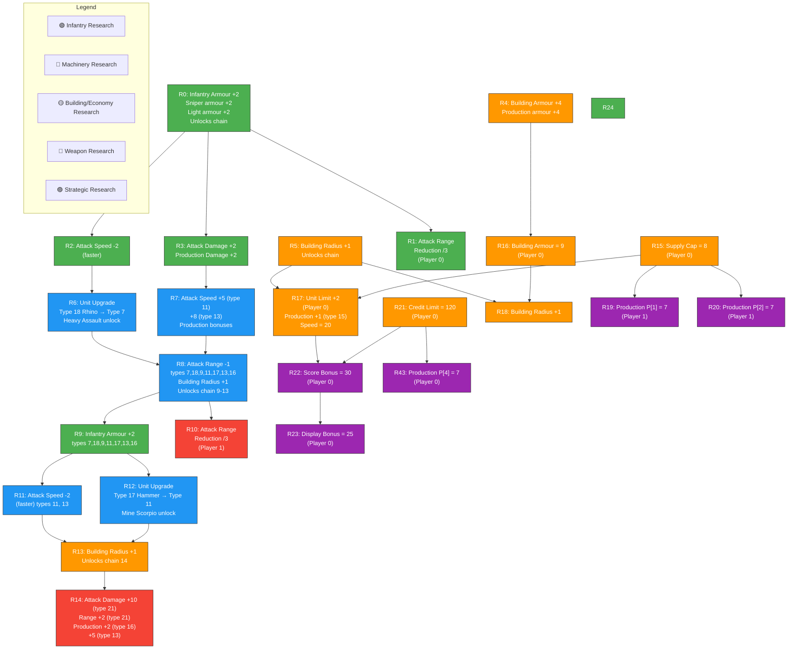
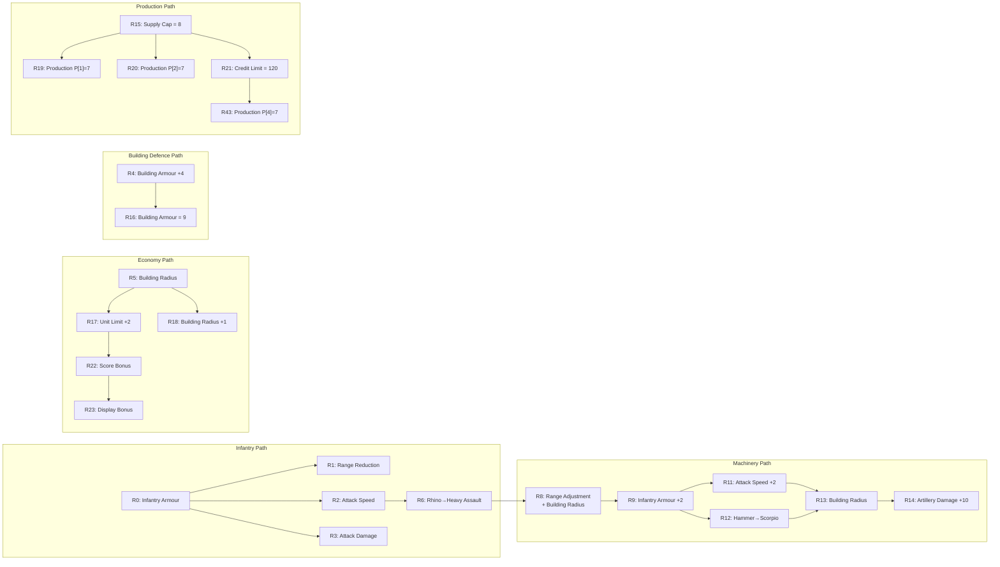

# Tech Tree - Confederation

## Confederation Research Dependencies

The Confederation represents the Global Confederation with advanced technology, superior armor and firepower. Their research tree is based on research IDs 0-23 and 43 from the `g(int i)` method analysis.

## Confederation Research Chain Summary

### Confederation Unit Unlock Sequence

| Research | Unlocks | Effect |
|----------|---------|--------|
| R0 (base) | Infantry, Grenadier, Light Assault | Infantry armour +2 |
| R6 | Heavy Assault (from Rhino) | Unit type upgrade |
| R8 | Sniper, Siege-capable units | Range adjustment |
| R12 | Mine Scorpio (from Hammer) | Unit type upgrade |
| R14 | Advanced Artillery | +10 damage, +2 range for type 21 |

### Confederation Research Effects Detail

| ID | Category | Effect | Target |
|----|----------|--------|--------|
| 0 | Infantry | Armour +2 | Infantry, Sniper, Light Assault |
| 1 | Infantry | Attack range reduction /3 | Player 0 |
| 2 | Infantry | Attack speed -2 (faster) | Specific unit types |
| 3 | Infantry | Attack damage +2 | All combat units |
| 4 | Building | Armour +4 | All buildings, production |
| 5 | Building | Radius +1 | Building placement range |
| 6 | Unit Upgrade | Type 18→Type 7 | Rhino → Heavy Assault |
| 7 | Machinery | Speed +5/+8, Production +8/+5 | Types 11, 13, 17, 9 |
| 8 | Machinery | Range -1, Radius +1 | Heavy units, building radius |
| 9 | Infantry | Armour +2 | Heavy unit types |
| 10 | Strategic | Range reduction /3 | Player 1 |
| 11 | Machinery | Speed -2 (faster) | Types 11, 13 |
| 12 | Unit Upgrade | Type 17→Type 11 | Hammer → Mine Scorpio |
| 13 | Building | Radius +1 | Building placement range |
| 14 | Artillery | Damage +10, Range +2 | Type 21, production bonuses |
| 15 | Economy | Supply cap = 8 | Player 0 |
| 16 | Building | Armour = 9 | Player 0 buildings |
| 17 | Economy | Unit limit +2, Production +1 | Player 0, type 15 |
| 18 | Building | Radius +1 | All buildings |
| 19 | Production | P[1] = 7 | Player 1 |
| 20 | Production | P[2] = 7 | Player 1 |
| 21 | Economy | Credit limit = 120 | Player 0 |
| 22 | Scoring | Score bonus = 30 | Player 0 |
| 23 | Scoring | Display bonus = 25 | Player 0 |
| 43 | Production | P[4] = 7 | Player 0 |
