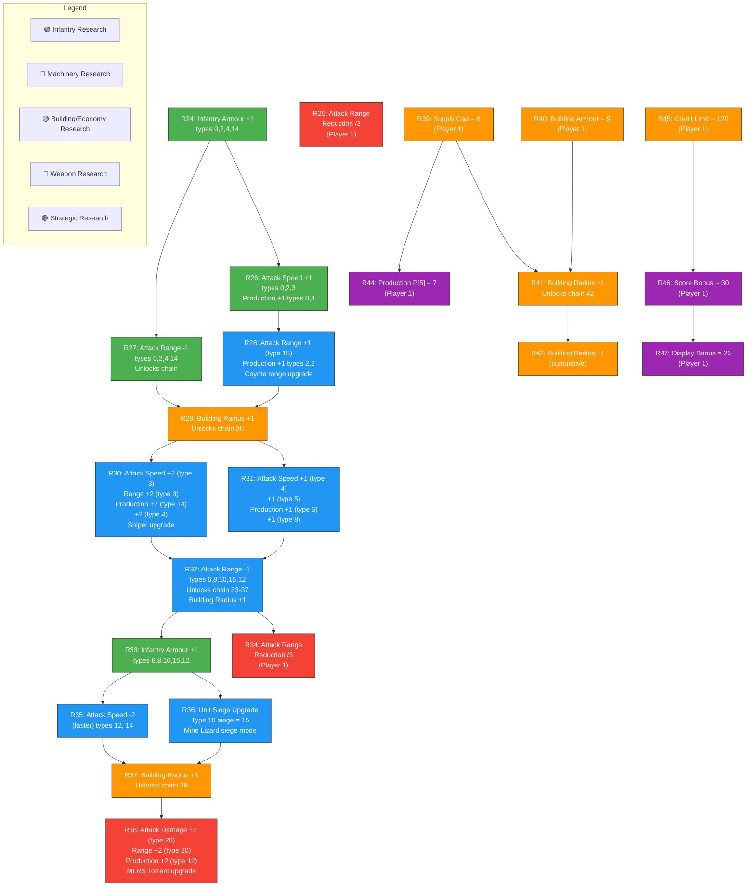
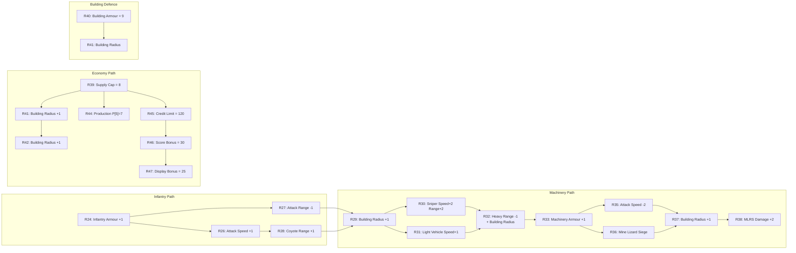
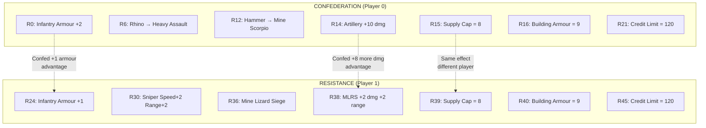

# Tech Tree - Rebels (Resistance)

## Resistance Research Dependencies

The Resistance represents the Liberation Army with speed, stealth and surprise tactics. Their research tree is based on research IDs 24-47 and 44 from the `g(int i)` method analysis. The Resistance collects resources faster and produces units more cheaply.

## Resistance Research Chain Summary

### Resistance vs Confederation Research Comparison

### Resistance Research Effects Detail

| ID | Category | Effect | Target |
|----|----------|--------|--------|
| 24 | Infantry | Armour +1 | Types 0, 2, 4, 14 |
| 25 | Strategic | Attack range reduction /3 | Player 1 |
| 26 | Infantry | Attack speed +1 | Types 0, 2, 3; Production types 0, 4 |
| 27 | Infantry | Attack range -1 | Types 0, 2, 4, 14 |
| 28 | Light Vehicle | Range +1 (Coyote) | Type 15; Production types 2 |
| 29 | Building | Radius +1 | Building placement range |
| 30 | Sniper | Speed +2, Range +2 | Type 3; Production types 14, 4 |
| 31 | Light Vehicle | Speed +1 | Types 4, 5; Production types 6, 8 |
| 32 | Heavy Machinery | Range -1, Radius +1 | Types 6, 8, 10, 15, 12 |
| 33 | Infantry | Armour +1 | Types 6, 8, 10, 15, 12 |
| 34 | Strategic | Range reduction /3 | Player 1 |
| 35 | Machinery | Attack speed -2 (faster) | Types 12, 14 |
| 36 | Unit Upgrade | Siege mode upgrade | Type 10 Mine Lizard = 15 |
| 37 | Building | Radius +1 | Building placement range |
| 38 | Artillery | Damage +2, Range +2 | Type 20 MLRS; Production type 12 |
| 39 | Economy | Supply cap = 8 | Player 1 |
| 40 | Building | Armour = 9 | Player 1 buildings |
| 41 | Building | Radius +1 | Building placement range |
| 42 | Building | Radius +1 (cumulative) | Building placement range |
| 43 | Production | P[4] = 7 | Player 0 (shared) |
| 44 | Production | P[5] = 7 | Player 1 |
| 45 | Economy | Credit limit = 120 | Player 1 |
| 46 | Scoring | Score bonus = 30 | Player 1 |
| 47 | Scoring | Display bonus = 25 | Player 1 |

### Faction Asymmetry Summary

| Aspect | Confederation | Resistance |
|--------|--------------|------------|
| **Armour** | +2 base infantry armour | +1 base infantry armour |
| **Speed** | Slower units, slower economy | Faster units, faster resource collection |
| **Firepower** | Higher per-unit damage (+10 artillery) | Moderate damage (+2 MLRS) |
| **Range** | Longer base ranges | Shorter ranges, compensated with upgrades |
| **Economy** | Standard income | Faster resource generation |
| **Cost** | More expensive units | Cheaper units, more cost-effective |
| **Production** | Standard build times | Faster production |
| **Tactics** | Defensive, head-on engagements | Hit-and-run, flanking, speed advantage |
| **Building Radius** | Starts with R5 (+1) | Starts with R29 (+1), cumulative |
| **Unique Units** | T-22 Zeus (heavy tank) | Coyote (rotating turret) |
