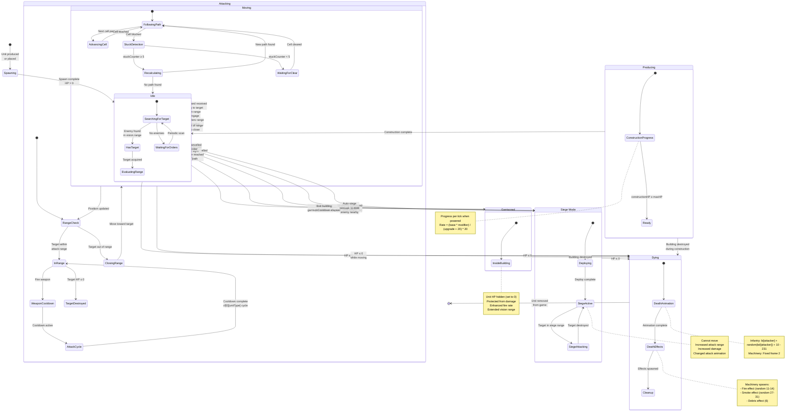
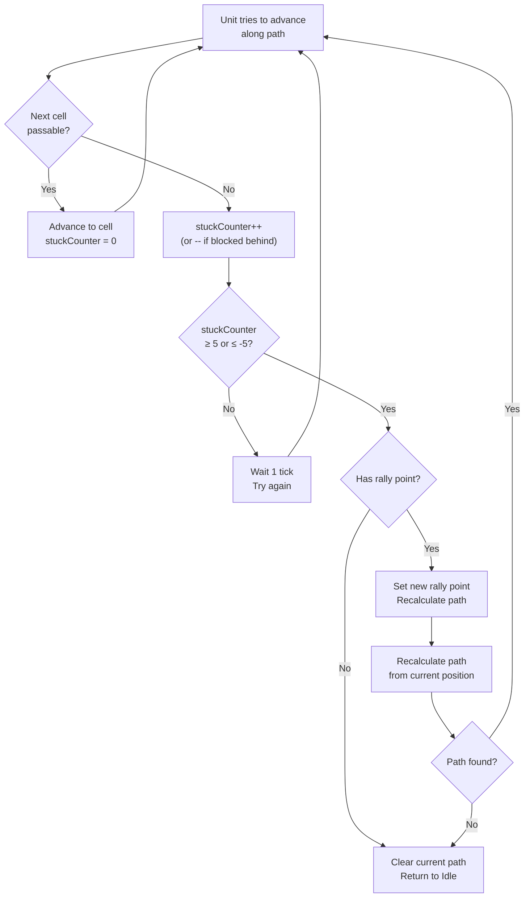

# Unit State Machine

## Unit States: Idle, Moving, Attacking, Dying, Producing, Siege Mode, Garrisoned

## Unit State Details

### State Data (from `ca` array offsets)

| Offset | Field | Idle | Moving | Attacking | Dying | Siege | Garrisoned |
|--------|-------|------|--------|-----------|-------|-------|------------|
| +0/+101 | posX/posY | Current | Changing | Current | Frozen | Frozen | N/A |
| +202/+303 | offX/offY | 0 | Moving | 0 | Frozen | 0 | N/A |
| +404 | facing | Last dir | Move dir | Target dir | Frozen | Target dir | Saved |
| +1010 | pathStart | = pathEnd | < pathEnd | = pathEnd | - | = pathEnd | - |
| +1111 | pathEnd | = pathStart | > pathStart | = pathStart | - | = pathStart | - |
| +1313 | attackCooldown | 0 | 0 | Counting | - | Counting | Counting |
| +1414 | attackState | 0 | 1 | 3 | - | 3 | 0 |
| +1515 | stuckCounter | 0 | -5 to +5 | 0 | - | 0 | 0 |
| +1616 | hp | >0 | >0 | >0 | -1 | >0 | 0 (hidden) |
| +1919 | targetUnit | 0 | 0 or target | Target ref | - | Target ref | 0 |
| +2828 | flags | 0 | bit 4 set | bits 0-2 set | - | bit 7 set | 0 |
| +2929 | flags2 | 0 | 0 | 0 | - | bit 5 set | 0 |

### Attack State Values (offset +1414)

| Value | State | Description |
|-------|-------|-------------|
| 0 | Idle | No attack activity |
| 1 | Moving | Moving toward target |
| 3 | Attacking | Actively firing at target |

### Flag Bits (offset +2828)

| Bit | Meaning | Set In |
|-----|---------|--------|
| 0 | Weapon 1 active | Attacking, Siege |
| 1 | Weapon 2 active | Attacking (multi-weapon) |
| 2 | Weapon 3 active | Attacking (multi-weapon) |
| 3 | Linked to another unit | Transport/garrison |
| 4 | Moving between cells | Moving |
| 5 | Stuck/redirecting | Moving (stuck) |
| 6 | Building production active | Producing |
| 7 | Siege mode / special state | Siege Mode |

### Unit Type Bitmasks

| Bitmask | Value | Meaning |
|---------|-------|---------|
| 16447 (0x403F) | bits 0-3, 5, 14 | Infantry unit types |
| 16256 (0x3F80) | bits 7-13 | Machinery unit types |
| 114688 (0x1C000) | bits 14-16 | Producing buildings / siege-capable |
| 65536 (0x10000) | bit 16 | Large unit (2-cell collision) |

### Stuck Recovery Logic

